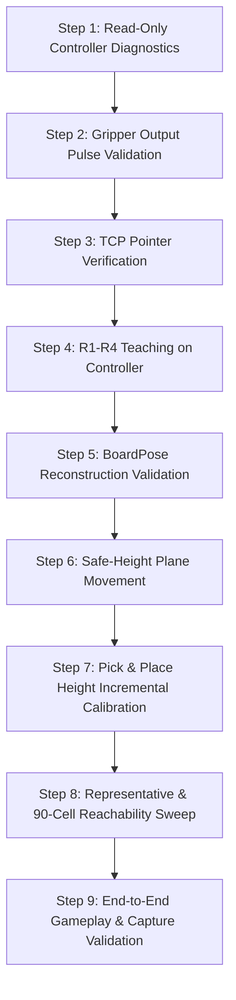

# Phase 4A — Hardware Test Tool Audit & Risk Assessment

**Document ID:** `DOC-P4A-AUDIT-001` 
**Target Architecture:** FAIRINO FR3 Manipulator, Two-Output End-Effector Gripper, CChess 9×10 Board 
**Target Repository:** `Khenggg/xiangqi_robot_TrainningAI_Final_6` 
**Branch:** `docs/phase4a-final-evidence-corrective` 
**Status:** COMPLETE / CANONICAL AUDIT

---

## 1. Executive Summary & Audit Scope

As part of **Phase 4A: Physical Commissioning Preparation**, a comprehensive static audit of all legacy hardware test scripts located in `tools/hardware_tests/` was performed.

The audit's purpose is to classify the safety posture of each script by following both direct commands and indirect function calls, identify dangerous legacy patterns that violate Phase 1–3 architectural contracts, and establish a strictly ordered, safe commissioning path.

> [!CAUTION]
> **NONE OF THE AUDITED TOOLS SHOULD BE RUN DIRECTLY AGAINST PHYSICAL HARDWARE WITHOUT REFACTORING.**
> Multiple legacy scripts automatically invoke `RobotEnable(1)` and `Mode(0)` without operator confirmation (either directly or via legacy wrapper wrappers), employ obsolete 2D perspective approximations that distort Cartesian space, command uncalibrated gripper pulse durations (up to 3.0 s) without position or thermal feedback, or command motion relative to undefined user frames (`user=1`).

---

## 2. Classification Taxonomy

Each script is assigned one of the following canonical classifications:

| Classification | Definition | Safety Action |
| :--- | :--- | :--- |
| **SAFE READ-ONLY** | Queries controller telemetry/teaching points without asserting outputs, enabling drives (`RobotEnable(0)`), switching modes, or commanding motion across its entire call tree. | Usable under supervision; verify frame assumptions. |
| **LOW-RISK MOTION** | Commands minimal, low-speed, pre-cleared motion with explicit confirmation gates. | Requires proposed commissioning speed override $\le 10\%$, safe Z elevation, and physical E-Stop in hand. |
| **DIRECT HARDWARE ACTUATION** | Directly pulses digital outputs or drives actuators without unified driver abstractions or interlocks. | Requires strict parameter bounding, pulse clamping, and mutual exclusion. |
| **LEGACY / UNSAFE FOR LIVE HARDWARE** | Violates current safety architecture (e.g., auto-enables robot drives, switches controller mode, continuous uncalibrated actuation, obsolete kinematics). | **PROHIBITED** from live execution. Must be refactored or superseded. |
| **OBSOLETE** | Targets deprecated robot models (e.g. FR5), legacy file structures, or superseded algorithms. | **RETIRED**. Retained only for historical reference. |

---

## 3. Individual Script Audit & Risk Assessment

### 3.1. `run_gripper_test.py`
* **File Path:** `tools/hardware_tests/run_gripper_test.py`
* **Classification:** `DIRECT HARDWARE ACTUATION` / `LEGACY / UNSAFE FOR LIVE HARDWARE`
* **Identified Mechanisms:**
  * Connects to RPC directly (`robot_sdk_core.RPC(config.ROBOT_IP)`); does **NOT** invoke `RobotEnable(1)` or `Mode(0)`.
  * Bypasses `TwoOutputGripperDriver` and raw-pulses Tool DO0 and DO1 for **3.0 seconds** consecutively via `SetToolDO`.
  * Attempts to actuate Controller Box DO0 and DO1 (`SetDO(0, 1)` / `SetDO(1, 1)` for 2.0 s), which are not connected to the end-effector gripper driver.
* **Failure Modes & Risks:**
  1. *Uncalibrated Pulse Duration:* A 3.0 s continuous pulse drives the physical end-effector into end-stops without travel sensing or motor load feedback, creating potential mechanical stress and coil heating.
  2. *Bypassing Driver Abstraction & Interlocks:* Direct RPC calls to digital outputs lack state tracking, mutual exclusion, and software-enforced deadtime.
  3. *Control Domain Confusion:* Firing Controller Cabinet DOs instead of Tool Flange DOs can trigger unintended external cabinet circuitry.
* **Disposition:** **PROHIBITED**. Superseded by `TwoOutputGripperDriver` utilizing bounded experimental pulse ladders.

---

### 3.2. `test_gripper_diagnose.py`
* **File Path:** `tools/hardware_tests/test_gripper_diagnose.py`
* **Classification:** `DIRECT HARDWARE ACTUATION` / `LEGACY / UNSAFE FOR LIVE HARDWARE`
* **Identified Mechanisms:**
  * Interactive terminal menu allowing manual toggling of Tool DO0 and Tool DO1 via `SetToolDO(ch, val, 0)`; does **NOT** invoke `RobotEnable(1)` or `Mode(0)`.
  * Commands manual pulses with hardcoded durations of **1.5 s to 3.0 s**.
  * Contains no software mutex or mutual-exclusion guard against commanding DO0 and DO1 simultaneously.
* **Failure Modes & Risks:**
  1. *Simultaneous Output Risk:* If DO0 and DO1 are commanded HIGH together, conflicting driver states or undefined electrical behavior may occur on the unverified end-effector circuit.
  2. *Uncalibrated Pulse Duration:* Pulses up to 3.0 s lack calibrated clamping and current/stroke monitoring.
* **Disposition:** **PROHIBITED in current form**. Must be rewritten to import `TwoOutputGripperDriver` with guaranteed mutual exclusion and pulse duration limits.

---

### 3.3. `test_tool_do0.py`
* **File Path:** `tools/hardware_tests/test_tool_do0.py`
* **Classification:** `DIRECT HARDWARE ACTUATION` / `LEGACY / UNSAFE FOR LIVE HARDWARE` / `OBSOLETE`
* **Identified Mechanisms:**
  * Connects directly via raw RPC (`robot_sdk_core.RPC(ROBOT_IP)`); does **NOT** invoke `RobotEnable(1)` or `Mode(0)`.
  * Bypasses `TwoOutputGripperDriver` and loops 5 times pulsing Tool DO0 for 3.0 s (`SetToolDO(0, 1, 0)`), sleeping 2.0 s, then setting `SetToolDO(0, 0, 0)`.
  * Assumes a single-acting gripper model where setting `SetToolDO(0, 0, 0)` opens the gripper.
* **Failure Modes & Risks:**
  1. *Wiring Model Incompatibility:* The current software model configures a two-output interface (`DO0 = CLOSE`, `DO1 = OPEN`). Setting `DO0 = 0` merely de-energizes the close channel; it does not drive the open channel under a two-output model.
  2. *Uncalibrated Pulse Duration:* 3.0 s close pulse causes prolonged stall against mechanical stops.
* **Disposition:** **OBSOLETE & RETIRED**. Single-channel polarity assumption does not match the configured software model.

---

### 3.4. `test_4_rooks.py`
* **File Path:** `tools/hardware_tests/test_4_rooks.py`
* **Classification:** `LEGACY / UNSAFE FOR LIVE HARDWARE` / `OBSOLETE`
* **Identified Mechanisms:**
  * Imports `FR5Robot` from `src.hardware.robot_VIP`.
  * Invokes `robot.connect()`, which **indirectly calls `RobotEnable(1)` and `Mode(0)`** inside `FR5Robot.connect()` without operator confirmation!
  * Reads teaching points R1–R4 and applies OpenCV 2D projective mapping (`cv2.getPerspectiveTransform`) to interpolate Cartesian $(X, Y)$ positions.
  * Dispatches Cartesian linear moves (`MoveCart`) targeting `user=1` instead of robot base frame (`user=0`).
  * Hardcodes motion heights: `PICK_Z = 168.0` mm and `SAFE_Z = 220.0` mm.
* **Failure Modes & Risks:**
  1. *Autonomous Power-On & Mode Change:* `FR5Robot.connect()` automatically energizes servo drives and configures controller mode upon script startup.
  2. *2D Perspective vs. 3D Rigid-Body Mismatch:* OpenCV projective transformation assumes planar image projection and does not enforce $SE(3)$ Euclidean rigidity ($\Delta X \perp \Delta Y$, scale $= 1.0$), inducing metric warping across the board.
  3. *Coordinate Frame Collision (`user=1`):* If User Frame 1 is uncalibrated or corrupted on the controller, Cartesian moves will execute in arbitrary directions.
  4. *Uncalibrated Z Values:* Hardcoded $Z=168.0$ mm has unknown origin provenance.
* **Disposition:** **PROHIBITED & OBSOLETE**. Superseded by `PhysicalTeachingPointBoardPoseProvider` (Kabsch-Umeyama $SE(3)$ rigid registration).

---

### 3.5. `test_calculate_cell_size.py`
* **File Path:** `tools/hardware_tests/test_calculate_cell_size.py`
* **Classification:** `LEGACY / UNSAFE FOR LIVE HARDWARE`
* **Identified Mechanisms:**
  * Constructs `FR5Robot()` and invokes `robot.connect()`.
  * **Critical Call-Tree Inspection:** `FR5Robot.connect()` internally executes `self.robot.RobotEnable(1)` and `self.robot.Mode(0)` on live hardware. It is therefore **NOT** safe read-only.
  * Reads controller teaching points `R1`, `R2`, `R3`, `R4` via `GetRobotTeachingPoint()`.
  * Calculates Euclidean edge lengths and checks 2D orthogonality.
  * Prompts operator to overwrite `config.py` with calculated non-standard cell dimensions (e.g. 39.8 mm vs. canonical 40.0 mm).
* **Failure Modes & Risks:**
  1. *Unsafe Connection Lifecycle:* Even though post-connection logic is read-oriented (querying teaching points), the connection method itself autonomously activates robot drives and alters controller mode without explicit operator safety clearance.
  2. *Config Corruption Risk:* Xiangqi boards are manufactured to canonical 40.0 mm grid pitch. Variations in taught points reflect teaching offset or pointer deflection, not elastic board distortion. Mutating canonical geometry in `config.py` corrupts downstream kinematics.
* **Disposition:** **PROHIBITED ON LIVE HARDWARE**. Replaced by read-only telemetry inspection tools and `PhysicalTeachingPointBoardPoseProvider.from_controller(...)`.

---

### 3.6. `test_corners.py`
* **File Path:** `tools/hardware_tests/test_corners.py`
* **Classification:** `LEGACY / UNSAFE FOR LIVE HARDWARE`
* **Identified Mechanisms:**
  * Uses `FR5Robot` wrapper, triggering autonomous `RobotEnable(1)` and `Mode(0)` via `robot.connect()`.
  * Computes 2D `cv2.getPerspectiveTransform` from taught points.
  * Executes joint-interpolated Cartesian motion (`movej_pose`) to all 4 corners at default speed 25%.
* **Failure Modes & Risks:**
  1. *Autonomous Power-On:* Robot drives energize automatically during `connect()`.
  2. *Projective Geometry Distortion:* Inaccurate interpolation between corners.
  3. *Kinematic Singularity / Path Deviation:* `movej_pose` executes joint-space interpolation ($PTP$). Intermediate arc trajectories bow downward, risking collision with board borders.
  4. *High Default Velocity:* 25% velocity exceeds proposed commissioning limits ($\le 10\%$).
* **Disposition:** **PROHIBITED**. Must be executed under unified `PhysicalFR3Backend` using validated linear motions and explicit safety gates.

---

### 3.7. `test_goto_xe_den.py`
* **File Path:** `tools/hardware_tests/test_goto_xe_den.py`
* **Classification:** `LEGACY / UNSAFE FOR LIVE HARDWARE`
* **Identified Mechanisms:**
  * Uses `FR5Robot` wrapper, triggering autonomous `RobotEnable(1)` and `Mode(0)` via `robot.connect()`.
  * Calculates position of Black Chariot `(row=0, col=0)` via obsolete linear offset formula: `BOARD_ORIGIN + OFFSET + col * CELL_SIZE`.
  * Calls `robot.pick_at(col, row)` which automatically descends to `PICK_Z` and triggers gripper close.
* **Failure Modes & Risks:**
  1. *Premature Descent & Actuation:* Executes full pick cycle (approach $\to$ descend $\to$ close $\to$ lift) without prior pick height calibration.
  2. *Coordinate Drift:* Linear offset model ignores board rotation/yaw relative to robot base.
* **Disposition:** **PROHIBITED**. Direct pick testing must follow the phased ladder in the validation runbook.

---

### 3.8. `test_move_to_pos.py`
* **File Path:** `tools/hardware_tests/test_move_to_pos.py`
* **Classification:** `LEGACY / UNSAFE FOR LIVE HARDWARE` / `OBSOLETE`
* **Identified Mechanisms:**
  * Explicitly calls `robot.RobotEnable(1)` and `robot.Mode(0)` in `connect_robot()`.
  * Loads `VIP/perspective.npy`—a transformation matrix generated for **camera pixel-to-board mapping**—and applies it directly to robot Cartesian coordinates.
  * Dispatches `MoveCart` with `user=1, tool=0`.
* **Failure Modes & Risks:**
  1. *CRITICAL MATHEMATICAL ERROR:* Directly feeding an image-space perspective matrix to robot Cartesian space generates nonsensical, unbounded $(X, Y)$ target coordinates, guaranteeing an emergency limit trip or severe physical crash.
  2. *Unverified Frame:* Relies on `user=1`.
* **Disposition:** **STRICTLY PROHIBITED & OBSOLETE**. Extreme risk of collision.

---

## 4. Synthesis of Dangerous Legacy Anti-Patterns

| Anti-Pattern | Scripts Exhibiting Pattern | Risk Level | Architectural Replacement |
| :--- | :--- | :--- | :--- |
| **Autonomous `RobotEnable(1)` & `Mode(0)`** | `test_move_to_pos` (direct); `test_calculate_cell_size`, `test_corners`, `test_4_rooks`, `test_goto_xe_den` (indirect via `FR5Robot.connect()`) *(Note: `run_gripper_test`, `test_gripper_diagnose`, `test_tool_do0` do NOT invoke `RobotEnable` or `Mode`)* | HIGH | Explicit operator gate; connect is strictly separated from enable (`connect()` is telemetry-only). `Connected != Enabled != Mode Configured`. |
| **OpenCV 2D Perspective Matrix** | `test_4_rooks`, `test_corners`, `test_move_to_pos` | HIGH | 3D $SE(3)$ Kabsch-Umeyama rigid registration via `PhysicalTeachingPointBoardPoseProvider`. |
| **Image Matrix Applied to Robot** | `test_move_to_pos` | CRITICAL | Robot and Vision coordinate systems strictly decoupled via contracts. |
| **Continuous 3.0s DO Pulses** | `run_gripper_test`, `test_gripper_diagnose`, `test_tool_do0` | HIGH | `TwoOutputGripperDriver` with bounded commissioning pulse ladders ($0.10\text{ s} - 0.30\text{ s}$). |
| **Simultaneous DO Risk / Missing Deadtime** | `test_gripper_diagnose`, `test_tool_do0` | HIGH | Mutex-enforced single output active with software-managed deadtime (`CURRENT_SOFTWARE_DEFAULT = 0.10s`). |
| **Non-Zero User Frame (`user=1`)** | `test_4_rooks`, `test_move_to_pos` | HIGH | All poses expressed in Robot Base Frame (`user=0`). |
| **Hardcoded Pick Heights (`PICK_Z=168`)** | `test_4_rooks`, `test_goto_xe_den` | HIGH | Calibrated board plane $+ Z_{\text{safe}}$ / $Z_{\text{pick}}$ offset ladder. |

---

## 5. Recommended Commissioning Tooling & Sequence

To commission the physical robot safely, the legacy scripts in `tools/hardware_tests/` must **not** be used as-is. Instead, commissioning must follow the formal Phase 4 Runbook (`docs/PHASE4_PHYSICAL_VALIDATION_RUNBOOK.md`) utilizing the unified Phase 3B architecture.

### Approved Tooling Path:
1. **Controller Inspection:** Read-only scripts or teaching pendant to confirm joint states, software limits, and R1–R4 coordinates in `user=0`. Initial connection is strictly telemetry-only (`connect()` does not energize servo drives or alter controller modes).
2. **Gripper Validation:** Dedicated test harness utilizing `TwoOutputGripperDriver` starting at an initial test pulse duration ($0.10\text{ s}$).
3. **BoardPose Validation:**
   - *Live Controller Extraction:* Call `PhysicalTeachingPointBoardPoseProvider.from_controller(backend)` to read and validate taught points directly from the robot controller.
   - *Offline Diagnostic Verification:* Call `PhysicalTeachingPointBoardPoseProvider.from_teaching_points(teaching_points, ...)` or `calibrate_board_from_teaching_points(teaching_points, ...)` on recorded R1–R4 coordinates to inspect residual and tilt metrics prior to any arm motion.
4. **Motion Validation:** Trajectory dispatch through the authoritative Phase 3B pipeline:
   $$\text{PieceMoveIntent / CaptureIntent} \longrightarrow \text{MotionResolver} \longrightarrow \text{MotionPlan} \longrightarrow \text{MotionExecutor} \longrightarrow \text{PhysicalFR3Backend}$$
   with manual confirmation before each trajectory phase. *(Note: Legacy `MotionCoordinator` is deprecated and retained strictly for backwards compatibility).*
