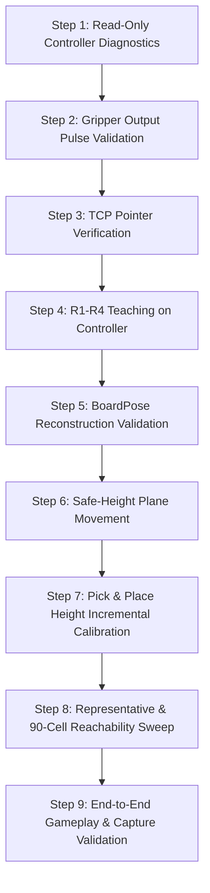

# Phase 4A — Hardware Test Tool Audit & Risk Assessment

**Document ID:** `DOC-P4A-AUDIT-001`  
**Target Architecture:** FAIRINO FR3 Manipulator, Custom Two-Output DC Gripper, CChess 9×10 Board  
**Target Repository:** `Khenggg/xiangqi_robot_TrainningAI_Final_6`  
**Branch:** `integration/unified-fr3-system`  
**Status:** COMPLETE / CANONICAL AUDIT  

---

## 1. Executive Summary & Audit Scope

As part of **Phase 4A: Physical Commissioning Preparation**, a comprehensive static audit of all legacy hardware test scripts located in `tools/hardware_tests/` was performed. 

The audit's purpose is to classify the safety posture of each script, identify dangerous legacy patterns that violate Phase 1–3 architectural contracts, and establish a strictly ordered, safe commissioning path.

> [!CAUTION]
> **NONE OF THE AUDITED TOOLS SHOULD BE RUN DIRECTLY AGAINST PHYSICAL HARDWARE WITHOUT MODIFICATION.**  
> Multiple legacy scripts automatically invoke `RobotEnable(1)` without operator confirmation, employ obsolete 2D perspective approximations that distort Cartesian space, command excessive gripper pulse durations (up to 3.0 s) that risk mechanical gear stripping/stalling, or command motion relative to undefined user frames (`user=1`).

---

## 2. Classification Taxonomy

Each script is assigned one of the following canonical classifications:

| Classification | Definition | Safety Action |
| :--- | :--- | :--- |
| **SAFE READ-ONLY** | Queries controller telemetry/teaching points without asserting outputs, enabling drives, or commanding motion. | Usable under supervision; verify frame assumptions. |
| **LOW-RISK MOTION** | Commands minimal, low-speed, pre-cleared motion with explicit confirmation gates. | Requires speed override $\le 10\%$, safe Z elevation, and physical E-Stop in hand. |
| **DIRECT HARDWARE ACTUATION** | Directly pulses digital outputs or drives actuators without unified driver abstractions or interlocks. | Requires strict parameter bounding, pulse clamping, and mutual exclusion. |
| **LEGACY / UNSAFE** | Violates current safety architecture (e.g., auto-enables robot, 3.0 s continuous actuation, obsolete kinematics). | **PROHIBITED** from direct execution. Must be refactored or superseded. |
| **OBSOLETE** | Targets deprecated robot models (e.g. FR5), legacy file structures, or superseded algorithms. | **RETIRED**. Retained only for historical reference. |

---

## 3. Individual Script Audit & Risk Assessment

### 3.1. `run_gripper_test.py`
* **File Path:** `tools/hardware_tests/run_gripper_test.py`
* **Classification:** `LEGACY / UNSAFE`
* **Identified Mechanisms:**
  * Connects to RPC and immediately invokes `robot.RobotEnable(1)`.
  * Pulses Tool DO0 and DO1 for **3.0 seconds** consecutively.
  * Attempts to actuate Controller Box DO0 and DO1 (`SetDO(0, 1)` / `SetDO(1, 1)`), which are not connected to the end-effector gripper driver.
* **Failure Modes & Risks:**
  1. *Motor Stall & Overheating:* Custom rack-and-pinion DC gripper full travel is estimated under 0.5 s. A 3.0 s pulse holds motor at stall against physical end-stops, inducing high current, relay wear, and motor winding heat.
  2. *Uncommanded Arm Power-On:* `RobotEnable(1)` energizes servo drives upon script start without manual confirmation or brake check.
  3. *Control Domain Confusion:* Firing Controller Cabinet DOs instead of Tool Flange DOs can trigger unintended external hardware.
* **Disposition:** **PROHIBITED**. Superseded by `TwoOutputGripperDriver` with 0.10 s – 0.30 s clamped pulses.

---

### 3.2. `test_gripper_diagnose.py`
* **File Path:** `tools/hardware_tests/test_gripper_diagnose.py`
* **Classification:** `DIRECT HARDWARE ACTUATION` / `LEGACY / UNSAFE`
* **Identified Mechanisms:**
  * Interactive terminal menu allowing manual toggling of Tool DO0 and Tool DO1 via `SetToolDO(ch, val, 0)`.
  * Commands manual pulses with hardcoded durations of **2.5 s to 3.0 s**.
  * Contains no software mutex or mutual-exclusion guard against commanding DO0 and DO1 simultaneously.
* **Failure Modes & Risks:**
  1. *Simultaneous Output Fire (H-Bridge Shoot-Through / Relay Conflict):* If DO0 (Close) and DO1 (Open) are driven HIGH together, the bidirectional driver circuit may short or enter an undefined electrical state.
  2. *Excessive Pulse Duration:* 2.5 s continuous drive forces gripper motor into mechanical stall.
* **Disposition:** **PROHIBITED in current form**. Must be rewritten to import `TwoOutputGripperDriver` with guaranteed mutual exclusion and pulse duration limits.

---

### 3.3. `test_tool_do0.py`
* **File Path:** `tools/hardware_tests/test_tool_do0.py`
* **Classification:** `LEGACY / UNSAFE` / `OBSOLETE`
* **Identified Mechanisms:**
  * Auto-enables robot via `RobotEnable(1)`.
  * Assumes a single-acting gripper model: sets `SetToolDO(0, 1, 0)` for 3.0 s (close) and assumes setting `SetToolDO(0, 0, 0)` opens it.
* **Failure Modes & Risks:**
  1. *Wiring Model Incompatibility:* The actual physical gripper is a 2-output driver (`DO0 = CLOSE`, `DO1 = OPEN`). Setting `DO0 = 0` merely de-energizes the close relay; it does *not* open the gripper. The script fails to function as intended.
  2. *Motor Stall on DO0:* 3.0 s close pulse causes mechanical stress.
* **Disposition:** **OBSOLETE & RETIRED**. Single-channel polarity assumption is physically false.

---

### 3.4. `test_4_rooks.py`
* **File Path:** `tools/hardware_tests/test_4_rooks.py`
* **Classification:** `LEGACY / UNSAFE` / `OBSOLETE`
* **Identified Mechanisms:**
  * Imports `FR5Robot` from `src.hardware.robot_VIP`.
  * Reads teaching points R1–R4 and applies OpenCV 2D projective mapping (`cv2.getPerspectiveTransform`) to interpolate Cartesian $(X, Y)$ positions.
  * Dispatches Cartesian linear moves (`MoveCart`) targeting `user=1` instead of robot base frame (`user=0`).
  * Hardcodes motion heights: `PICK_Z = 168.0` mm and `SAFE_Z = 220.0` mm.
* **Failure Modes & Risks:**
  1. *2D Perspective vs. 3D Rigid-Body Mismatch:* OpenCV projective transformation assumes planar image projection and does not enforce $SE(3)$ Euclidean rigidity ($\Delta X \perp \Delta Y$, scale $= 1.0$). This induces non-linear metric warp across the board.
  2. *Coordinate Frame Collision (`user=1`):* If User Frame 1 is uncalibrated, corrupted, or altered on the controller, Cartesian moves will execute in arbitrary directions, risking severe head-on collisions with the table.
  3. *Uncalibrated Z Values:* Hardcoded $Z=168.0$ mm has unknown origin provenance and risks driving the gripper through the board.
* **Disposition:** **PROHIBITED & OBSOLETE**. Superseded by Phase 1 `BoardPoseProvider` (Kabsch-Umeyama $SE(3)$ transformation).

---

### 3.5. `test_calculate_cell_size.py`
* **File Path:** `tools/hardware_tests/test_calculate_cell_size.py`
* **Classification:** `SAFE READ-ONLY` (Telemetry) / `LEGACY` (Logic)
* **Identified Mechanisms:**
  * Connects via RPC, reads controller teaching points `R1`, `R2`, `R3`, `R4` via `GetRobotTeachingPoint()`.
  * Calculates Euclidean edge lengths and checks 2D orthogonality.
  * Prompts operator to overwrite `config.py` with calculated non-standard cell dimensions (e.g. 39.8 mm vs. canonical 40.0 mm).
* **Failure Modes & Risks:**
  1. *Read-Only Safety:* Safe regarding physical motion (issues zero actuation commands).
  2. *Config Corruption Risk:* Xiangqi boards are rigidly manufactured to canonical 40.0 mm grid pitch. Slight variations in taught points reflect teaching error/pointer deflection, *not* elastic board stretching. Overwriting nominal cell size violates `PHYSICAL_GEOMETRY_CONTRACT.md`.
* **Disposition:** **SAFE READ-ONLY FOR INSPECTION**. Do NOT accept prompts to mutate `config.py`.

---

### 3.6. `test_corners.py`
* **File Path:** `tools/hardware_tests/test_corners.py`
* **Classification:** `LEGACY / UNSAFE`
* **Identified Mechanisms:**
  * Uses `FR5Robot` wrapper.
  * Computes 2D `cv2.getPerspectiveTransform` from taught points.
  * Executes joint-interpolated Cartesian motion (`movej_pose`) to all 4 corners at default speed 25%.
* **Failure Modes & Risks:**
  1. *Projective Geometry Distortion:* Inaccurate interpolation between corners.
  2. *Kinematic Singularity / Path Deviation:* `movej_pose` executes joint-space interpolation ($PTP$). While corner endpoints are defined, intermediate arc trajectories bow downward, risking collision with board borders if clearance is marginal.
  3. *High Default Velocity:* 25% velocity is excessive for unverified workspace boundaries.
* **Disposition:** **PROHIBITED in current form**. Must be executed under unified `PhysicalFR3Backend` at $\le 10\%$ speed using validated linear motions.

---

### 3.7. `test_goto_xe_den.py`
* **File Path:** `tools/hardware_tests/test_goto_xe_den.py`
* **Classification:** `LEGACY / UNSAFE`
* **Identified Mechanisms:**
  * Auto-enables robot and queries state.
  * Calculates position of Black Chariot `(0, 0)` via obsolete linear offset formula: `BOARD_ORIGIN + OFFSET + col * CELL_SIZE`.
  * Calls `robot.pick_at(col, row)` which automatically descends to `PICK_Z` and triggers gripper close.
* **Failure Modes & Risks:**
  1. *Premature Descent & Actuation:* Executes full pick cycle (approach $\to$ descend $\to$ close $\to$ lift) without prior pick height calibration.
  2. *Coordinate Drift:* Linear offset model completely ignores board rotation/yaw relative to robot base.
* **Disposition:** **PROHIBITED**. Direct pick testing must follow the phased ladder in the validation runbook.

---

### 3.8. `test_move_to_pos.py`
* **File Path:** `tools/hardware_tests/test_move_to_pos.py`
* **Classification:** `LEGACY / UNSAFE` / `OBSOLETE`
* **Identified Mechanisms:**
  * Auto-enables robot: `RobotEnable(1)`, `Mode(0)`.
  * Loads `VIP/perspective.npy`—a transformation matrix generated for **camera pixel-to-board mapping**—and applies it directly to robot Cartesian coordinates.
  * Dispatches `MoveCart` with `user=1, tool=0`.
* **Failure Modes & Risks:**
  1. *CRITICAL MATHEMATICAL ERROR:* Directly feeding an image-space perspective matrix to robot Cartesian space generates nonsensical, unbounded $(X, Y)$ target coordinates, guaranteeing an emergency limit trip or severe physical crash.
  2. *Unverified Frame:* Relies on `user=1`.
* **Disposition:** **STRICTLY PROHIBITED & OBSOLETE**. Extreme risk of collision.

---

## 4. Synthesis of Dangerous Legacy Anti-Patterns

| Anti-Pattern | Scripts Exhibiting Pattern | Risk Level | Architectural Replacement |
| :--- | :--- | :--- | :--- |
| **Autonomous `RobotEnable(1)`** | `run_gripper_test`, `test_tool_do0`, `test_goto_xe_den`, `test_move_to_pos` | HIGH | Explicit operator gate; connect is strictly separated from enable. |
| **OpenCV 2D Perspective Matrix** | `test_4_rooks`, `test_corners`, `test_move_to_pos` | HIGH | 3D $SE(3)$ Kabsch-Umeyama rigid registration via `BoardPoseProvider`. |
| **Image Matrix Applied to Robot** | `test_move_to_pos` | CRITICAL | Robot and Vision coordinate systems strictly decoupled via contracts. |
| **Continuous 3.0s DO Pulses** | `run_gripper_test`, `test_gripper_diagnose`, `test_tool_do0` | HIGH | `TwoOutputGripperDriver` with 0.10s–0.30s pulse ladder and hard clamps. |
| **Simultaneous DO Risk / Missing Deadtime** | `test_gripper_diagnose`, `test_tool_do0` | HIGH | Mutex-enforced single output active with 100 ms electrical deadtime. |
| **Non-Zero User Frame (`user=1`)** | `test_4_rooks`, `test_move_to_pos` | HIGH | All poses expressed in Robot Base Frame (`user=0`). |
| **Hardcoded Pick Heights (`PICK_Z=168`)** | `test_4_rooks`, `test_goto_xe_den` | HIGH | Calibrated board plane $+ Z_{\text{safe}}$ / $Z_{\text{pick}}$ offset ladder. |

---

## 5. Recommended Commissioning Tooling & Sequence

To commission the physical robot safely, the legacy scripts in `tools/hardware_tests/` must **not** be used as-is. Instead, commissioning must follow the formal Phase 4 Runbook (`docs/PHASE4_PHYSICAL_VALIDATION_RUNBOOK.md`) utilizing the unified architecture.

### Approved Tooling Path:
1. **Controller Inspection:** Read-only scripts or teaching pendant to confirm joint states, software limits, and R1–R4 coordinates in `user=0`.
2. **Gripper Validation:** Dedicated test harness utilizing `TwoOutputGripperDriver` starting at 0.10 s pulse duration.
3. **BoardPose Validation:** Offline verification script passing recorded R1–R4 points into `BoardPoseProvider.from_teaching_points()` to evaluate residual and tilt metrics prior to any arm motion.
4. **Motion Validation:** `PhysicalFR3Backend` executing through `MotionCoordinator` with manual confirmation before each trajectory phase.
