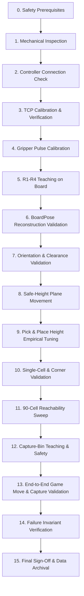

# Phase 4 — Physical Validation & Commissioning Runbook

**Document ID:** `DOC-P4-RUNBOOK-001`  
**System:** Xiangqi Robotic System (FAIRINO FR3 Manipulator, Two-Output Custom DC Gripper, CChess Vision System)  
**Target Branch:** `integration/unified-fr3-system`  
**Applicability:** On-site Laboratory Commissioning & Physical Calibration  
**Execution Authority:** Physical Commissioning Engineer / Lead Systems Operator  

---

## Document Overview & Engineering Protocol

This runbook defines the mandatory, step-by-step physical commissioning and calibration procedure for the Xiangqi robot. It provides an exhaustive testing ladder designed to transition the robot from uncalibrated hardware to fully autonomous, validated physical operation.



### Core Execution Rules
1. **Never Assume Geometric Defaults as Physical Truth:** Constants such as pick height ($4.715\text{ mm}$), clearance ($40.0\text{ mm}$), and gripper pulse duration ($0.30\text{ s}$) are provisional assumptions. They must be validated empirically.
2. **Fail-Closed Principle:** If any step fails to meet its acceptance criteria, autonomous motion must halt immediately. Proceeding to downstream motion tests with an unverified kinematic base is strictly prohibited.
3. **No Dynamic Board Tracking:** The board is assumed rigidly clamped during gameplay. If the board is moved after calibration, calibration is void and must be re-run from Section 5.

---

## Section 0: Safety Prerequisites & Physical Preconditions

Before powering on or establishing controller communication, verify and enforce all safety conditions:

### 0.1 Personnel & Environment
* [ ] **Physical E-Stop Access:** The physical emergency stop pendant must be uncoiled, unlatched, and held in hand by the primary operator. Response time to trip must be $<0.5\text{ s}$.
* [ ] **Workspace Exclusion Zone:** A minimum clearance boundary of $1.0\text{ m}$ around the entire robot reach envelope must be cleared of unnecessary personnel, tools, loose cabling, and clutter.
* [ ] **Human Play Area Separation:** The human player's seating area and designated reach zone must remain clear of the robot's default trajectory corridors.
* [ ] **Eye & Hand Protection:** Operator must wear safety glasses during high-payload or clamp-testing sequences. No loose jewelry or clothing near rotating joints.

### 0.2 Robot & Fixture Stability
* [ ] **Robot Base Fixture:** Verify torque on all FR3 base mounting bolts ($4\times \text{M10}$ or manufacturer standard). Base plate must exhibit zero flex or angular compliance under manual push-pull.
* [ ] **Board Anchor Security:** The physical Xiangqi board must be clamped or rigidly registered against fixed reference stops. It must not slip, rock, or warp under finger pressure.
* [ ] **Camera Mount Rigidity:** Overhead camera rig must be firmly clamped; zero vibration transmission from the robot base plate to the camera frame.
* [ ] **End-Effector Fasteners:** Check mechanical torque on flange adapter plate, gripper bracket, and jaw fingers. Ensure zero backlash in the rack/pinion or linear drive.

### 0.3 Electrical & Controller State
* [ ] **Cabling Clearance:** End-effector umbilical cable (power and DO control wires) must be routed with sufficient slack across joints 4, 5, and 6. Manually verify full rotational freedom without tension or pinch points.
* [ ] **Low-Speed Mode Enforced:** Controller speed override must be locked at $\le 10\%$ for all initial commissioning steps.
* [ ] **Frame Sanity:** Controller must operate strictly in Base Frame (`user=0`) and active Tool Frame must match the chosen mechanical setup.

---

## Section 1: Mechanical Inspection & Fixture Verification

### 1.1 Objective
Confirm that all mechanical components, fasteners, guide rails, and mounting brackets conform to engineering tolerance prior to energizing drives.

### 1.2 Inspection Procedure
1. **Manipulator Joints:** Visually inspect joints 1 through 6 for grease leakage, physical denting, or cable wear.
2. **Gripper Mechanism:**
   * Manually slide the gripper jaws across their stroke (if motor allows unpowered backdrive) or inspect the rack and pinion teeth for debris.
   * Verify symmetric jaw opening relative to the tool centerline.
   * Confirm rubber/silicone jaw pads are securely adhered, clean, and free of oil.
3. **Board Flatness & Leveling:**
   * Place a precision machinist spirit level across the board in the $X$ direction (columns 0 to 8) and $Y$ direction (rows 0 to 9).
   * Record board bubble deviation. Surface inclination must be $< 1.0^\circ$ to prevent piece sliding and uneven grip engagement.
4. **Game Piece Audit:**
   * Inspect canonical Xiangqi pieces. Measure 5 random pieces with digital calipers:
     * Nominal Diameter: $22.50 \pm 0.30\text{ mm}$
     * Nominal Height: $9.43 \pm 0.25\text{ mm}$
   * Confirm piece tops are flat and free of burrs.

---

## Section 2: Controller Connection & Telemetry Verification

### 2.1 Objective
Verify read-only RPC communication with the FAIRINO FR3 controller without commanding drive enable, brake release, or physical motion.

### 2.2 Inspection Protocol
1. **Network Configuration:**
   * Verify host workstation IP is on the same subnet as FR3 controller (default: `192.168.58.2` host, `192.168.58.6` controller).
   * Execute ICMP ping test: `ping 192.168.58.6`. Packet loss must be $0\%$, latency $< 2\text{ ms}$.
2. **Read-Only RPC Handshake:**
   * Initialize SDK RPC client in read-only mode (`robot_sdk_core.RPC(ip)`).
   * Query controller status codes:
     * `GetSDKVersion()`: Confirm compatible SDK release.
     * `GetRobotState()`: Record state code (Confirm not in emergency stop or drive fault).
     * `GetActualJointPosDegree()`: Query joint angles $[J_1, J_2, J_3, J_4, J_5, J_6]$.
     * `GetActualTCPPose(0)`: Query current Cartesian TCP pose in Base Frame (`user=0`).
     * `GetActualToolFlangePose(0)`: Query flange pose in Base Frame.
3. **Safety Pass Criteria:**
   * All queries return error code `0`.
   * Telemetry values are physically plausible (e.g. joints match physical visual posture).
   * **Robot drives remain DE-ENERGIZED (Enable state = 0).**

---

## Section 3: Tool Center Point (TCP) Calibration

### 3.1 Dual-TCP Architecture Definition
The system explicitly separates two distinct tool definitions. Never conflate calibration contact geometry with gameplay grasp geometry.

```
       Flange (J6) [Z=0]
            │
            │  Flange-to-Jaws ≈ 147.5 - 150 mm
            │
      ┌─────┴─────┐
      │  Gripper  │
      │   Body    │
      └─────┬─────┘
           ╱ ╲
          │   │  ◄── TCP_GRASP (Functional Center between Jaws, Z ≈ +150mm)
          └───┘
            │
            ▼   (Optional mode)
            │  ◄── TCP_CALIBRATION (Sharp Contact Pointer Tip)
            ▼
```

1. **`TCP_CALIBRATION`:**
   * The physical reference point used strictly for teaching and locating board fiducials (R1–R4).
   * *Mode A (Pointer Tool):* A designated, rigid conical stylus mounted to the tool holder whose apex is calibrated via 4-point/6-point tool calibration method on the controller. In Mode A, controller XYZ coincides directly with the contact point ($Offset = [0, 0, 0]$).
   * *Mode B (Gripper Jaw Contact):* One specific corner or designated edge of the gripper jaw is used as contact point. Requires explicit, verified Cartesian offset from Flange to Contact Tip.
2. **`TCP_GRASP`:**
   * The operational gameplay TCP located at the geometric center between the rubber jaw pads when closed.
   * Canonical Flange-to-TCP distance: Approximately $150.0\text{ mm}$ (historical CAD: $147.5\text{ mm}$).
   * *Critical Deprecation:* The legacy value of $218.0\text{ mm}$ is strictly obsolete and must never be loaded.

### 3.2 TCP Calibration Procedure
1. Configure Tool Frame 1 on the FAIRINO controller as `TCP_CALIBRATION`.
2. Execute the standard 4-point orientation-invariant calibration method against a fixed external sharp pointer:
   * Approach the fixed calibration point from 4 widely divergent wrist orientations ($>30^\circ$ difference in roll/pitch/yaw).
   * Record calculated tool offset: $[X_{\text{tool}}, Y_{\text{tool}}, Z_{\text{tool}}]$.
   * Residual error of TCP calibration must be $< 0.5\text{ mm}$.
3. Configure Tool Frame 2 on the controller as `TCP_GRASP`:
   * Set $X_{\text{grasp}} = 0.0\text{ mm}$, $Y_{\text{grasp}} = 0.0\text{ mm}$, $Z_{\text{grasp}} \approx 150.0\text{ mm}$.
   * Precise $Z_{\text{grasp}}$ offset will be refined during Pick/Place calibration (Sections 9 & 10).

---

## Section 4: Gripper Electrical & Pulse Calibration

### 4.1 Gripper Hardware Wiring Specifications
The end-effector utilizes a custom bidirectional DC motor driven via two tool-flange digital outputs:
* **Tool DO1:** Gripper **OPEN**
* **Tool DO0:** Gripper **CLOSE**

> [!CAUTION]
> **ELECTRICAL MUTUAL EXCLUSION MANDATE:**  
> Never assert Tool DO0 and Tool DO1 simultaneously. Simultaneous assertion risks electrical shoot-through, driver short-circuit, or destructive motor conflict.  
> An electrical deadtime of at least **100 ms** must separate any state transition. Both outputs must remain LOW (`0`) when idle.

### 4.2 Pulse Duration Ladder Protocol
The gripper uses a rack-and-pinion drive without integrated limit switches. The motor must be driven with calibrated pulse durations rather than continuous voltage to prevent mechanical stall, motor overheating, and gear tooth stripping.

**Goal:** Identify the **minimum reliable pulse duration** ($t_{\text{pulse}}$) that achieves full stroke travel without prolonged stall against mechanical stops.

```
Pulse Ladder Sequence:
0.10s ──► 0.15s ──► 0.20s ──► 0.25s ──► 0.30s (Max Safe Threshold)
```

1. Set software override speed to $\le 10\%$. Arm remains stationary at safe park position.
2. **Open Pulse Ladder:**
   * Start at $t = 0.10\text{ s}$.
   * Command: `DO0=0`, `DO1=1` for $t$, then `DO1=0`. Wait $0.5\text{ s}$ settle time.
   * Inspect jaw displacement using calipers. Measure opening width.
   * Increment by $+0.05\text{ s}$ until jaws reach full open mechanical travel ($>32\text{ mm}$ clearance for $22.5\text{ mm}$ piece).
   * **Immediate Stop Condition:** Stop increasing pulse duration immediately if motor emits an audible high-pitch stall buzz, excessive gear clicking, or driver heats up.
3. **Close Pulse Ladder:**
   * Place an unweighted test piece ($22.5\text{ mm}$) centered between jaws.
   * Start at $t = 0.10\text{ s}$.
   * Command: `DO1=0`, `DO0=1` for $t$, then `DO0=0`. Wait $0.5\text{ s}$ settle time.
   * Test piece retention: Lightly grasp piece and apply vertical pull ($~1\text{ N}$).
   * Increment pulse duration by $+0.05\text{ s}$ until piece is firmly gripped without slipping and jaw rubber visibly compresses slightly ($0.2\text{ mm} - 0.5\text{ mm}$).
   * Do not exceed the duration required for secure retention.
4. **Record Findings:**
   * Record $t_{\text{open, nominal}}$ and $t_{\text{close, nominal}}$ in the validation log.
   * Current software default of $0.30\text{ s}$ is a provisional upper bound; record actual empirical value.

---

## Section 5: R1–R4 Teaching Procedure

### 5.1 Physical Meaning of R1–R4 Fiducials
The four teaching points R1, R2, R3, R4 correspond strictly to **outermost grid intersections** of the Xiangqi playing surface, **NOT** the physical wooden/plastic edges of the board.

```
       Col 0 (Black)                      Col 8 (Black)
Row 0   R1 ───┼───┼───┼───┼───┼───┼───┼─── R2
        │   │   │   │ ╲ │ ╱ │   │   │   │
        ├───┼───┼───┼───*───┼───┼───┼───┤
        │   │   │   │ ╱ │ ╲ │   │   │   │
        ├───┼───┼───┼───┼───┼───┼───┼───┤  Playable Grid:
        │                              │  320 mm wide (Cols 0-8)
        ~~~~~~~~~~~~~~~~~~~~~~~~~~~~~~~~  360 mm high (Rows 0-9)
        │   Chu Hà            Hán Giới │  Grid Spacing: 40.0 mm
        ~~~~~~~~~~~~~~~~~~~~~~~~~~~~~~~~
        ├───┼───┼───┼───┼───┼───┼───┼───┤
        │   │   │   │ ╲ │ ╱ │   │   │   │
        ├───┼───┼───┼───*───┼───┼───┼───┤
        │   │   │   │ ╱ │ ╲ │   │   │   │
Row 9   R4 ───┼───┼───┼───┼───┼───┼───┼─── R3
       Col 0 (Red)                        Col 8 (Red)
```

* **R1:** Intersection at `(col=0, row=0)` — Black Left Chariot (Xe Đen Trái)
* **R2:** Intersection at `(col=8, row=0)` — Black Right Chariot (Xe Đen Phải)
* **R3:** Intersection at `(col=8, row=9)` — Red Right Chariot (Xe Đỏ Phải)
* **R4:** Intersection at `(col=0, row=9)` — Red Left Chariot (Xe Đỏ Trái)

Canonical Board-Local Coordinates ($Z=0$ at board surface):
* $\mathbf{p}_{\text{R1}} = (-160.0, -180.0, 0.0)\text{ mm}$
* $\mathbf{p}_{\text{R2}} = (+160.0, -180.0, 0.0)\text{ mm}$
* $\mathbf{p}_{\text{R3}} = (+160.0, +180.0, 0.0)\text{ mm}$
* $\mathbf{p}_{\text{R4}} = (-160.0, +180.0, 0.0)\text{ mm}$

### 5.2 Teaching Protocol (Step-by-Step)
1. **Teaching Tool Active:** Mount calibrated pointer stylus. Activate `tool_id = 1` (`TCP_CALIBRATION`). Set user frame to Base Frame (`user_id = 0`).
2. **Teaching Order:** Points must be taught in exact sequence: **R1 $\to$ R2 $\to$ R3 $\to$ R4**.
3. **Contact Method:**
   * Using the teaching pendant in manual jog mode (step size: $0.1\text{ mm}$ near surface), jog the tip until it contacts the precise center of the printed crosshair intersection.
   * Use the "slip of paper" method: A standard $80\text{ g/m}^2$ paper strip ($0.1\text{ mm}$ thick) is slid between the stylus tip and board. Stop descending when light drag is felt on the paper without deflecting the board.
4. **Orientation Invariant:** Maintain identical tool orientation angles $[Rx, Ry, Rz]$ across all 4 points (pointing vertically downward, $Rx \approx \pm 180^\circ, Ry \approx 0^\circ$).
5. **Data Capture:** For each point, query controller and record:
   * Cartesian Pose: $[X, Y, Z, Rx, Ry, Rz]$
   * Joint Angles: $[J_1, J_2, J_3, J_4, J_5, J_6]$
   * Active Tool ID, User ID ($=0$), Operator Name, Timestamp.
6. Save points as controller teaching points `R1`, `R2`, `R3`, `R4`.

---

## Section 6: BoardPose Reconstruction Validation

### 6.1 Objective
Run the taught R1–R4 coordinates through the mathematical validation pipeline implemented in `src/domain/board_pose_provider.py`. Determine whether the taught points form a physically valid, planar, rectangular board geometry.

### 6.2 Acceptance Thresholds & Mathematical Contracts
The validation thresholds are hard-coded in the project domain authority. Do not alter these limits:

| Metric | Nominal Contract | Warning Threshold | Hard Failure Threshold | Corrective Action on Failure |
| :--- | :--- | :--- | :--- | :--- |
| **Width (R1–R2, R4–R3)** | $320.00\text{ mm}$ | $|\Delta| > 3.0\text{ mm}$ | $|\Delta| > 5.0\text{ mm}$ | Re-teach R1–R4. Verify pointer deflection. |
| **Height (R2–R3, R1–R4)** | $360.00\text{ mm}$ | $|\Delta| > 3.0\text{ mm}$ | $|\Delta| > 5.0\text{ mm}$ | Re-teach R1–R4. Inspect board scaling. |
| **Edge Symmetry Diff** | $0.00\text{ mm}$ | — | $> 5.0\text{ mm}$ | Re-check crosshair center alignment. |
| **Diagonal (R1–R3, R2–R4)**| $481.66\text{ mm}$ | — | $|\text{Diag}_1 - \text{Diag}_2| > 8.0\text{ mm}$ | Board is skewed/sheared. Check orthogonality. |
| **RMS Fit Residual** | $0.00\text{ mm}$ | $> 2.0\text{ mm}$ | $> 3.0\text{ mm}$ | Poor Kabsch rigid registration. Re-teach points. |
| **Max Corner Residual** | $0.00\text{ mm}$ | — | $> 5.0\text{ mm}$ | One specific corner is outlier. Re-teach corner. |
| **Max Plane Residual** | $0.00\text{ mm}$ | — | $> 3.0\text{ mm}$ | Board surface is warped/bowed. Fix mechanical shims. |
| **Board Tilt Angle** | $0.00^\circ$ | $> 2.5^\circ$ | $> 5.0^\circ$ | Table/board is not level. Level base plate/table. |
| **Frame Consistency** | User = 0 | — | `user_id != 0` or Tool Mismatch | Abort. Reconfigure frames on controller. |

### 6.3 Validation Execution
1. Feed the recorded R1–R4 points into `BoardPoseProvider.from_teaching_points(teaching_points, calibration_profile)`.
2. Evaluate output metrics:
   * If any metric breaches **Hard Failure**, calibration is **REJECTED**. No motion allowed.
   * If any metric triggers **Warning**, record `PASS_WITH_WARNING`. Operator must inspect board shimming before proceeding.
   * If all metrics pass within warning limits, record `PASS`. The generated $SE(3)$ transformation matrix $\mathbf{T}_{\text{base}}^{\text{board}}$ is accepted.

---

## Section 7: Tool Orientation Validation

### 7.1 Historical Provenance vs. Physical Validation
The historical orientation vector stored in project configs is approximately:
$$\mathbf{R}_{\text{hist}} = [Rx = -179.164^\circ, Ry = -3.047^\circ, Rz = -26.304^\circ]$$
*This value represents an unverified teaching point from an earlier prototype. It must be treated as a provisional reference, not validated truth.*

### 7.2 Orientation Verification Protocol
1. **Verticality Check:**
   * Jog arm to board center `(col=4, row=4.5)`. Command tool orientation to $[Rx=-180.0^\circ, Ry=0.0^\circ, Rz=\theta_z]$.
   * Place a precision machinist square on the board surface against the cylindrical body of the gripper.
   * Verify perpendicularity along both $X$ and $Y$ board axes ($< 0.5^\circ$ cant).
2. **Jaw Parallelism / Piece Engagement:**
   * With jaws partially closed, observe the jaw flat faces relative to the board grid lines.
   * Choose yaw angle ($Rz$) such that jaws are cleanly parallel to the grid columns ($Y$-axis) or rows ($X$-axis), allowing consistent grip without clipping neighboring pieces.
3. **Singularity & Joint Limit Margin:**
   * Query controller joint angles at all 4 corners under chosen orientation.
   * Ensure Joint 5 (wrist pitch) remains at least $15^\circ$ away from zero (wrist singularity: $J_5 \approx 0^\circ$).
   * Ensure Joints 4 and 6 are $> 20^\circ$ away from software end-stops.
4. **Final Acceptance:** Record validated $[Rx, Ry, Rz]$ in `phase4_physical_validation_log.md`.

---

## Section 8: Safe Clearance Height Validation

### 8.1 Clearance Contract
The nominal transit clearance height in software is:
$$Z_{\text{safe}} = Z_{\text{board\_surface}} + 40.0\text{ mm}$$

### 8.2 Physical Clearance Ladder
1. Place standard game pieces ($9.43\text{ mm}$ height) at various board cells, including along board edges and inside the river.
2. In the capture bin area, simulate a stack of captured pieces (stack height up to $20\text{ mm}$).
3. Command arm with closed gripper to transit at $Z = Z_{\text{safe}} = +40.0\text{ mm}$ across the board diagonal (R1 to R3, R4 to R2):
   * Speed: $10\%$. Operator finger on E-stop.
   * Minimum dynamic clearance between the lowest point of gripper jaws and the tallest piece must be $\ge 25.0\text{ mm}$.
   * Verify overhead camera enclosure: Ensure highest point of robot elbow/wrist maintains $\ge 50.0\text{ mm}$ clearance from camera lens/mount at all transit waypoints.
4. **Pass Criteria:** Zero interference, zero near-miss vibration, cable loom remains untensioned.

---

## Section 9: Pick-Height Calibration Protocol

### 9.1 Provisional Geometry & The "Pick != Place" Rule
* Theoretical piece center above board surface: $H_{\text{piece}} / 2 = 9.43 / 2 = 4.715\text{ mm}$.
* In software, `PICK_TCP_HEIGHT_MM = 4.715` is a provisional baseline.
* **Do not assume Pick Height equals Place Height.** Due to piece compliance, friction, jaw chamfer, and table deflection, optimal pick height often requires a slight lower grip or jaw clearance offset.

### 9.2 Controlled Approach Ladder (Step-by-Step)
Place a clean piece at cell `(4, 4)`. Align gripper over cell at $Z_{\text{safe}}$. Open jaws fully.

```
Approach Ladder:
Z = +20.0 mm ──► +15.0 mm ──► +10.0 mm ──► +7.0 mm ──► +5.0 mm ──► +4.7 mm ──► +4.5 mm
```

1. **Stepwise Descent:**
   * Jog downward in manual increments: $20.0\text{ mm} \to 10.0\text{ mm} \to 7.0\text{ mm}$.
   * Below $7.0\text{ mm}$, reduce jog step to $0.2\text{ mm}$.
2. **Visual Engagement Check:**
   * At each step, inspect jaw pad contact zone relative to piece height ($9.43\text{ mm}$).
   * Confirm jaws do not touch the board surface. Minimum gripper-to-board clearance must be $\ge 1.5\text{ mm}$ when jaws are fully closed.
3. **Grip Engagement Trials:**
   * At candidate heights ($Z = 6.0, 5.5, 5.0, 4.7, 4.5\text{ mm}$), execute a grip pulse:
     * Close gripper ($t_{\text{close}}$).
     * Lift vertically to $Z_{\text{safe}}$ at $10\%$ speed.
     * Inspect piece stability: Look for piece tilt, twist, slippage, or drop.
     * Shake test: Command small horizontal jog ($\pm 5\text{ mm}$ at $20\text{ mm/s}$). Piece must not dislodge.
4. **Determine Envelope:**
   * Record $Z_{\text{pick, max}}$ (highest height with $100\%$ reliable grip).
   * Record $Z_{\text{pick, min}}$ (lowest height before jaw edge contacts board or pinches table).
   * Set Nominal: $Z_{\text{pick, nominal}} = \frac{Z_{\text{pick, max}} + Z_{\text{pick, min}}}{2}$.
   * Tolerance envelope: $\pm 0.5\text{ mm}$.

---

## Section 10: Place-Height Calibration Protocol

### 10.1 Objective
Calibrate $Z_{\text{place}}$ to ensure the piece is released flush onto the board surface without excessive drop impact (which causes piece bouncing/skidding) and without crushing the piece into the board (which causes servo stall or table deflection).

### 10.2 Place Height Descent Ladder
1. Pick piece from `(4, 4)`. Move to `(4, 5)` at $Z_{\text{safe}}$.
2. Descend incrementally toward candidate place heights ($Z = 7.0, 6.0, 5.5, 5.0, 4.7, 4.5\text{ mm}$).
3. At candidate height:
   * Execute Open pulse ($t_{\text{open}}$).
   * Observe piece release dynamics:
     * Does piece drop $> 1.0\text{ mm}$? If yes, height is too high (causes bounce).
     * Does piece remain stuck between opening jaws? If yes, check jaw travel or opening pulse duration.
     * Does gripper press piece into board, causing board deflection before release? If yes, height is too low (crush risk).
4. Retract vertically to $Z_{\text{safe}}$:
   * Ensure opening jaws clear the piece diameter ($22.5\text{ mm}$) without brushing against piece rim.
   * Measure placement offset: Digital caliper measurement from printed intersection crosshair to piece center. Radial error must be $< 1.5\text{ mm}$.
5. Record calibrated $Z_{\text{place, nominal}}$ and operating tolerance.

---

## Section 11: Single-Cell End-to-End Motion Validation

### 11.1 Objective
Execute a complete, integrated pick-and-place cycle on a single representative central cell before initiating multi-cell or high-speed trajectories.

### 11.2 Standard Single-Cell Trajectory Cycle
Selected Cell: `(col=4, row=4)` to `(col=4, row=5)`
1. **Approach:** Transit from Home $\to$ Pre-pick waypoint $(col=4, row=4, Z_{\text{safe}})$ at $10\%$ speed.
2. **Descend:** Linear descent $\to (col=4, row=4, Z_{\text{pick}})$ at $50\text{ mm/s}$.
3. **Grip:** Assert Close pulse ($t_{\text{close}}$). Wait $0.25\text{ s}$ settle time.
4. **Lift:** Linear vertical retract $\to (col=4, row=4, Z_{\text{safe}})$ at $50\text{ mm/s}$. Confirm piece held in jaws.
5. **Transit:** Linear motion $\to (col=4, row=5, Z_{\text{safe}})$.
6. **Descend:** Linear descent $\to (col=4, row=5, Z_{\text{place}})$.
7. **Release:** Assert Open pulse ($t_{\text{open}}$). Wait $0.25\text{ s}$ settle time.
8. **Retreat:** Linear vertical retract $\to (col=4, row=5, Z_{\text{safe}})$.
9. **Return:** Transit back to Home position.

### 11.3 Telemetry & Accuracy Audit
* Measure final piece placement error $\Delta X, \Delta Y$ relative to crosshair.
* Confirm controller reported return code `0` on all Cartesian segments.
* Cycle must complete with zero audible vibration, zero path overshoot, and clean jaw release.

---

## Section 12: Four-Corner Validation (Boundary Reachability)

### 12.1 Objective
Validate Cartesian reachability, kinematic conditioning, and clearance at the extreme spatial limits of the playable surface prior to whole-board operations.

### 12.2 Corner Test Matrix
*Use actual playable grid intersections, not outer table corners:*
* **Corner 1 (R1 Region):** Cell `(col=0, row=0)` — Near-left boundary
* **Corner 2 (R2 Region):** Cell `(col=8, row=0)` — Near-right boundary
* **Corner 3 (R3 Region):** Cell `(col=8, row=9)` — Far-right boundary
* **Corner 4 (R4 Region):** Cell `(col=0, row=9)` — Far-left boundary

### 12.3 Execution Protocol
1. For each corner cell in order (C1 $\to$ C2 $\to$ C3 $\to$ C4):
   * Approach $(col, row, Z_{\text{safe}})$.
   * Descend to $(col, row, Z_{\text{pick}})$.
   * Inspect mechanical clearance:
     * Check distance between robot elbow/forearm and safety fence or overhead frame.
     * Check umbilical cable tension across J4/J5/J6.
     * Check wrist singularity margin ($J_5$ deviation from $0^\circ$).
   * Ascend back to $Z_{\text{safe}}$.
2. **Pass Criteria:** Controller IK succeeds without error codes (`0` or `112`), zero cable binding, mechanical clearance $\ge 30\text{ mm}$ everywhere.

---

## Section 13: Center & Edge Reachability Validation

### 13.1 Objective
Inspect kinematic posture across major workspace axes to detect joint configuration flips, arm branch changes, or orientation cants along board boundaries.

### 13.2 Representative Cell Matrix
1. **Center:** `(col=4, row=4)` and `(col=4, row=5)` (Board midpoint / River)
2. **Top Edge (Black Baseline):** `(col=4, row=0)`
3. **Bottom Edge (Red Baseline):** `(col=4, row=9)`
4. **Left Edge:** `(col=0, row=4)`
5. **Right Edge:** `(col=8, row=4)`

### 13.3 Protocol
Execute approach and descent to $Z_{\text{safe}}$ and $Z_{\text{pick}}$ at each representative position. Verify robot kinematic branch ($config$ parameter in FAIRINO controller) remains consistent and does not induce sudden joint flips during linear moves between these points.

---

## Section 14: Full 90-Cell Reachability Sweep

### 14.1 Sweep Protocol (Phase 1: Safe-Height / Approach-Only)
> [!IMPORTANT]
> To minimize collision risk, **do NOT perform physical gripping at all 90 cells during the first sweep**.  
> The first 90-cell sweep is strictly an **Approach-Only Sweep** executed at $Z_{\text{safe}}$ with gripper closed.

1. Load `docs/templates/phase4_cell_validation.csv` on workstation.
2. Automate sequential linear transit across all 90 cells:
   * Row 0 (Cols 0 to 8) $\to$ Row 1 (Cols 8 down to 0) [Bousterphedon pattern].
   * Velocity: $10\%$, linear motion.
3. At each cell:
   * Query IK solution for $(col, row, Z_{\text{safe}})$ and $(col, row, Z_{\text{pick}})$.
   * Check for controller warnings, joint limit proximity, or singularity proximity.
   * Mark `approach_pass = 1` and `pick_pose_pass = 1` in CSV if IK and motion succeed cleanly.
4. **Phase 2: Spot Pick Check:**
   * Select 10 random cells from the matrix and execute physical piece pick-and-place.
   * Record `pick_success = 1`, `place_success = 1`, and measured $\Delta XY$ error.

---

## Section 15: Capture-Bin Calibration & Safety

### 15.1 Physical Provenance of Capture Bin
Current capture bin coordinates in legacy configs are unvalidated placeholders. The physical bin must be explicitly taught and registered.

### 15.2 Teaching Protocol
1. Mount capture bin in its designated physical location (typically to the side of the board, outside human playing zone).
2. Teach three designated waypoints:
   * **`BIN_APPROACH`:** High transit point outside board boundary, elevated at $Z \ge Z_{\text{safe}} + 20\text{ mm}$.
   * **`BIN_DROP`:** Centered over bin mouth, at safe drop height ($Z_{\text{bin\_rim}} + 15\text{ mm}$).
   * **`BIN_RETREAT`:** Vertical retract point identical to `BIN_APPROACH`.
3. Record Cartesian poses in `user=0`, active tool `TCP_GRASP`.

### 15.3 Trajectory Corridor Safety Check
1. Manually command linear motion from Board Center `(4, 4)` $\to$ `BIN_APPROACH` $\to$ `BIN_DROP`.
2. Verify corridor:
   * Trajectory must **never** sweep over the human player's designated table side.
   * Trajectory must maintain $> 40\text{ mm}$ clearance from board side border and camera mount posts.
   * Confirm captured piece held in jaws cannot collide with active game pieces during the transit.

---

## Section 16: One-Piece Move End-to-End Validation

### 16.1 Objective
Execute a complete, autonomous non-capture game move from perception/intent through physical execution and verification.

### 16.2 Sequence
Move: Central Cannon `(col=1, row=2)` $\to$ `(col=4, row=2)`
1. Place Red Cannon piece precisely at `(1, 2)`.
2. Dispatch move command through `MotionCoordinator` / `PhysicalFR3Backend`.
3. Verify step-by-step physical progression:
   * [ ] Pre-move safe height approach to source.
   * [ ] Clean vertical descent and jaw closure.
   * [ ] Vertical lift without tilting adjacent pieces.
   * [ ] Transit at $Z_{\text{safe}}$ along straight linear path.
   * [ ] Descent to destination `(4, 2)`.
   * [ ] Clean jaw release without piece dragging.
   * [ ] Vertical retreat and return to Home.
4. **Verification Measurement:**
   * Inspect destination cell with digital caliper: Piece center must be within $1.5\text{ mm}$ of crosshair.
   * Verify overhead vision detection registers piece at `(4, 2)` with high confidence.

---

## Section 17: Capture Move End-to-End Validation

### 17.1 Objective
Execute a multi-stage capture move: Attacking piece captures opponent piece at target square.

### 17.2 Mandatory Physical Invariants
* **Invariant 1:** The captured piece must be completely removed from the board into the capture bin **before** the attacking piece is picked.
* **Invariant 2:** The attacking piece must remain completely undisturbed while the captured piece is being extracted.
* **Invariant 3:** Adjacent friendly or enemy pieces surrounding the destination cell must not be touched or displaced.

### 17.3 Sequence
Scenario: Black Chariot at `(col=0, row=0)` captures Red Chariot at `(col=0, row=9)`.
1. Place Black piece at `(0, 0)`; place Red piece at `(0, 9)`.
2. Dispatch capture move:
   * **Phase 1 (Opponent Removal):**
     * Arm moves to destination `(0, 9)`.
     * Descends, grips Red piece, lifts to $Z_{\text{safe}}$.
     * Transits to `BIN_APPROACH` $\to$ `BIN_DROP`.
     * Opens gripper, dropping Red piece into bin.
     * Retracts to `BIN_RETREAT`.
   * **Phase 2 (Attacker Relocation):**
     * Arm transits to source `(0, 0)`.
     * Descends, grips Black piece, lifts to $Z_{\text{safe}}$.
     * Transits to destination `(0, 9)`.
     * Descends, releases Black piece flush on square.
     * Retracts to $Z_{\text{safe}}$ and returns Home.
3. **Pass Criteria:**
   * Red piece safely inside bin.
   * Black piece centered at `(0, 9)` ($\Delta XY \le 1.5\text{ mm}$).
   * All intermediate waypoints cleared cleanly.

---

## Section 18: Failure Scenarios & Recovery Invariants

The physical commissioning team must test and document system behavior under unexpected physical anomalies.

| Anomaly / Failure Mode | Expected Physical State | Expected Software State | Auto-Continue? | Operator Action Required | Recalibration Required? |
| :--- | :--- | :--- | :--- | :--- | :--- |
| **Gripper Close Fails (No grip)** | Jaws close fully; piece missing or skewed. | `PieceNotDetected` / `GripTimeout` error. | **NO (Hard Halt)** | Inspect piece alignment; re-seat piece. | No (Retry pick). |
| **Gripper Open Fails** | Jaws remain clamped around piece at destination. | Driver timeout / DO fault. | **NO (Hard Halt)** | Manual override via E-Stop; release piece. | Gripper pulse inspection. |
| **Piece Slips in Transit** | Piece falls onto board during horizontal transit. | Vision detects board discrepancy after cycle. | **NO (Hard Halt)** | E-Stop immediately. Remove fallen piece. | Yes: Re-evaluate $t_{\text{close}}$ / $Z_{\text{pick}}$. |
| **Piece Stuck in Jaws** | Gripper opens but piece adheres to rubber pad. | Retract lifts piece back up. Vision detects empty dst. | **NO (Hard Halt)** | Clean rubber pads; apply anti-stick dry wipe. | No. |
| **Destination Cell Occupied** | Destination contains unexpected obstacle/piece. | Pre-move vision sanity check fails. | **NO (Hard Halt)** | Clear workspace; align physical board with game state. | No. |
| **Board Shifted / Bumped** | Board physically nudged during human move. | Vision detects fiducial shift $> 2.0\text{ mm}$. | **NO (Hard Halt)** | Stop autonomous play. Re-clamp board. | **YES: Complete R1–R4 Re-teach.** |
| **Controller RPC Drop** | Arm holds current position; drives hold position. | `RPCConnectionError` raised in backend. | **NO (Hard Halt)** | Check Ethernet cabling, controller power. | No (Re-connect). |
| **MoveCart Rejection (-112/err)** | Arm halts immediately without motion. | Motion coordinator catches exception. | **NO (Hard Halt)** | Check Cartesian coordinates for singularity. | Verify BoardPose matrix. |
| **Capture Phase 1 OK, Phase 2 Fail** | Opponent in bin; attacker remains at source. | Exception during attacker pick; game paused. | **NO (Hard Halt)** | Manual recovery mode; do not resume blindly. | Check source cell clearance. |

---

## Section 19: Physical Result Classification & Acceptance Criteria

Every test phase must be graded against the canonical six-tier result taxonomy:

```
┌────────────────────────────────────────────────────────────────────────┐
│                   PHYSICAL RESULT TAXONOMY                             │
├────────────────────┬───────────────────────────────────────────────────┤
│ PASS               │ Meets 100% of nominal tolerances and contracts.   │
│ PASS_WITH_WARNING  │ Meets hard limits; minor non-critical deviation.  │
│ FAIL_RETRY         │ Transient operational failure (e.g. piece skew).  │
│ FAIL_RECALIBRATE   │ Systematic geometric deviation; re-teaching req.  │
│ FAIL_HARDWARE      │ Mechanical/electrical component failure.          │
│ FAIL_SAFETY        │ Immediate E-stop trip; safety boundary violation. │
└────────────────────┴───────────────────────────────────────────────────┘
```

1. **`PASS`:** All numerical metrics within nominal contract (e.g. Board RMS $\le 2.0\text{ mm}$, placement error $\le 1.5\text{ mm}$, zero motion faults).
2. **`PASS_WITH_WARNING`:** Metric exceeds warning limit but within hard failure limit (e.g. Board tilt $2.5^\circ - 5.0^\circ$, Board RMS $2.0 - 3.0\text{ mm}$). Requires operator sign-off and notation.
3. **`FAIL_RETRY`:** Transient failure attributable to piece placement or timing. Allowed up to 2 retries before escalating.
4. **`FAIL_RECALIBRATE`:** Taught geometry violates physical invariants (e.g. edge length error $> 5.0\text{ mm}$, diagonal error $> 8.0\text{ mm}$, pick failure on $>2$ cells). Autonomous testing is halted; R1–R4 and TCP must be re-calibrated.
5. **`FAIL_HARDWARE`:** Physical breakdown (motor stall, stripped gear, broken wire, controller failure). Immediate shutdown.
6. **`FAIL_SAFETY`:** E-stop tripped, collision detected, cable tension violation, or human zone incursion. System locked out until incident investigation is completed.

---

## Section 20: Data Preservation & Provenance Logging

All calibration artifacts generated during physical commissioning must be permanently preserved with complete engineering provenance:

### 20.1 Calibration Constant Provenance Schema
Every empirical constant committed to the repository must include this metadata header:

```json
{
  "constant_name": "PICK_TCP_HEIGHT_MM",
  "calibrated_value": 4.50,
  "unit": "mm",
  "measurement_method": "incremental_contact_and_retention_ladder",
  "sample_count": 25,
  "date_calibrated": "YYYY-MM-DD",
  "robot_serial": "FR3-2024-XXXX",
  "controller_firmware": "v3.7.x",
  "tool_id_used": "TCP_GRASP_ID2",
  "board_id": "STANDARDIZED_WOODEN_CC_01",
  "operator_signature": "Operator Name",
  "status": "PHYSICALLY_VALIDATED"
}
```

### 20.2 Mandatory Artifacts to Archive
1. Filled validation log: `docs/templates/phase4_physical_validation_log.md` (renamed with date/run tag).
2. Completed 90-cell CSV: `docs/templates/phase4_cell_validation.csv`.
3. Exported raw controller teaching points file from FR3 pendant (`teaching_points_backup.json`).
4. Controller system error log export.
