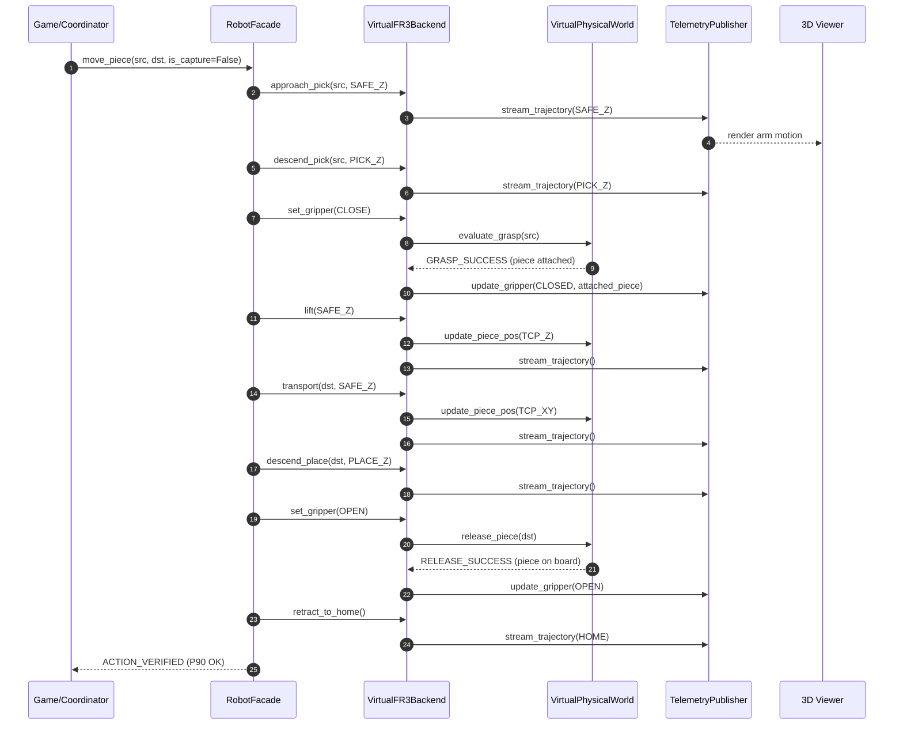
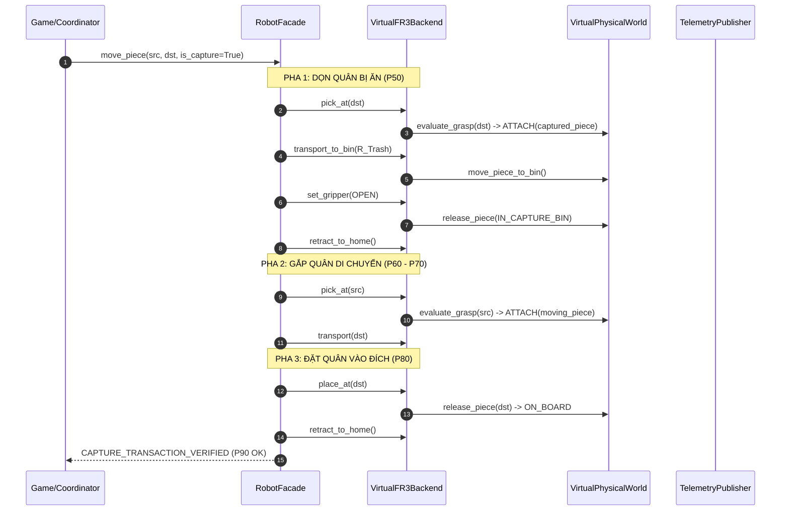

# SIMULATION ARCHITECTURE SPECIFICATION & AUDIT REPORT (PHASE P0)
**Repository:** `Khenggg/xiangqi_robot_TrainningAI_Final_6`  
**Branch:** `feature/virtual-robot-3d-simulator`  
**HEAD SHA:** `410910638e81d35305b22a2ab9a0a04c136875fc`  
**Status:** Approved Phase P0 Baseline  
**Date:** 2026-09-15  

---

## 1. EXECUTIVE SUMMARY

Tài liệu này xác lập bản kiểm toán toàn diện (Audit Baseline) và đặc tả kiến trúc mô phỏng (Simulation Architecture Contract) cho dự án Xiangqi Robot trong quá trình phát triển **Virtual FAIRINO FR3 Simulator**.

### Mục tiêu cốt lõi:
1. Xây dựng **VirtualFR3Backend** thay thế trong suốt cho robot vật lý: Game Logic, Computer Vision thật, Xiangqi AI thật và State Machine không được biết actuator hiện tại là phần cứng thật hay ảo.
2. Thiết lập kiến trúc **Digital Twin** phân tách rõ ràng giữa:
   - **Actuator Layer (Backend)**
   - **Telemetry Layer (Data Stream)**
   - **Visualization Layer (Three.js 3D Viewer)**
3. Đảm bảo an toàn phần cứng tuyệt đối (**NO PHYSICAL ACTUATION**) trong toàn bộ quá trình phát triển.
4. Chuẩn hóa nguồn chân lý hình học (Physical Geometry Single Source of Truth) và chuỗi biến đổi hệ tọa độ có thể truy vết (Coordinate Transformation Chain).

---

## 2. AUDIT SNAPSHOT

| Hạng mục kiểm toán | Hiện trạng thực tế tại HEAD `4109106` | Đánh giá |
| :--- | :--- | :--- |
| **Robot Model trong Simulator** | Chỉ có `FR5Kinematics` trong Python; `telemetry_publisher.py` phát cứng `robot_model: "FR5"`. Chưa có kinematics cho FR3. | **CRITICAL GAP** |
| **3D Viewer Model Selection** | Có STL mesh và URDF cho cả FR3 và FR5 trong `robot-3d-viewer/assets/`. Tuy nhiên nếu chọn FR3 trong giao diện, `live_state.mjs` sẽ reject toàn bộ packet từ Python vì mismatch `robot_model`. | **CRITICAL GAP** |
| **Thao tác Robot trong DRY_RUN** | Trong `robot_VIP.py`, các lệnh di chuyển chỉ `print` và `time.sleep(0.2)`, KHÔNG phát animation telemetry. Trong `main.py`, khi `DRY_RUN=True`, lệnh `hw.robot.move_piece()` bị bỏ qua hoàn toàn. | **CRITICAL GAP** |
| **Quy ước Bàn cờ (Board Convention)** | Tại baseline P0 (`4109106`), `board.mjs` định nghĩa `START_LAYOUT` với **Red ở row 0, Black ở row 9**, ngược quy ước chuẩn của dự án. <br>**[ĐÃ KHẮC PHỤC TRONG P1]**: Chuẩn hóa qua `layout.mjs` với Black row 0..4 (Tướng tại 4,0), Red row 5..9 (Tướng tại 4,9). | **RESOLVED IN P1** (Trước đó là CRITICAL GAP) |
| **Cập nhật Quân cờ 3D** | Quân cờ chỉ được vẽ tĩnh lúc load trang (`buildPieces()`). Không có cơ chế nhận trạng thái bàn cờ qua WebSocket, không có liên kết với gripper. Hàm `movePieceTo()` chỉ teleport tức thời và chưa từng được gọi trong runtime. | **HIGH GAP** |
| **Hiển thị Gripper 3D** | Packet telemetry có trường `"gripper": true/false`, nhưng `main.mjs` hoàn toàn không có mesh đầu kẹp và không xử lý trường này. | **MEDIUM GAP** |
| **Python Dependencies** | `telemetry_publisher.py` import `websockets`, nhưng `requirements.txt` KHÔNG khai báo dependency `websockets`. | **HIGH GAP** |
| **An toàn Bộ Kiểm thử (Tests)** | 8/10 file test trong `tests/` và `tools/` gọi trực tiếp SDK kết nối phần cứng và phát lệnh chuyển động thật / đóng mở kẹp thật. Chỉ có 2 unit test an toàn. | **SAFETY RISK** |

---

## 3. CURRENT ARCHITECTURE

```
[Real Camera / USB Cam]
       │
       ▼
[CameraMonitor (Thread ngầm)] ───► [YOLO11 Occupancy Model (best.pt)]
       │
       ▼
[SnapshotDetector (T1/T2)]
       │
       ▼
[GameState / Xiangqi Rules] ◄──► [AI Controller (Cloud API / Moonfish Engine)]
       │
       ▼
[HardwareManager / robot_VIP.py]
   ├── [Real FR5 Robot via RPC 192.168.58.2] (Khi DRY_RUN=False)
   └── [DRY_RUN Mode]: Print logs + Sleep 0.2s (Bị bypass ở main.py)

[TelemetryPublisher (WebSocket :8765)] ──(Chỉ phát Home Pose tĩnh khi start)──► [robot-3d-viewer]
```

### Điểm nghẽn kiến trúc hiện tại:
- `robot_VIP.py` đóng vai trò vừa là Real Hardware Client, vừa chứa logic nội suy bàn cờ, vừa ôm dở dang logic dry-run giả lập.
- `TelemetryPublisher` chạy một luồng độc lập phát 25 Hz một pose cố định, không được các hàm chuyển động `pick_at()`, `place_at()`, `move_piece()` cập nhật quỹ đạo khi chạy dry-run.
- Viewer Three.js chỉ là một màn hình hiển thị thụ động góc khớp, hoàn toàn không có mô hình vật lý ảo của quân cờ.

---

## 4. CURRENT CALL GRAPHS

### 4.1. Normal Move (Không ăn quân)
```
main.py (Game Loop)
  │
  ├─► [Kiểm tra state.turn == 'b' & AI Worker trả về nước đi (s, d)]
  │
  ├─► if not config.DRY_RUN:
  │      if hw.robot.connected:
  │         hw.robot.move_piece(s[0], s[1], d[0], d[1], is_capture=False)
  │            │
  │            ├─► pick_at(s[0], s[1])
  │            │      ├─► board_to_pose(s, SAFE_Z)
  │            │      ├─► board_to_pose(s, PICK_Z)
  │            │      ├─► gripper_ctrl(GRIPPER_OPEN)  --> SetToolDO(0, 0)
  │            │      ├─► move_safe_pose(pose_safe)    --> MoveCart(...)
  │            │      ├─► movel_pose(pose_pick)        --> MoveCart(...)
  │            │      ├─► gripper_ctrl(GRIPPER_CLOSE) --> SetToolDO(0, 1)
  │            │      └─► movel_pose(pose_safe)        --> MoveCart(...)
  │            │
  │            ├─► if distance >= 4:
  │            │      move_to_extra_safe(s[0], s[1])   --> MoveCart(...)
  │            │
  │            ├─► place_at(d[0], d[1])
  │            │      ├─► board_to_pose(d, SAFE_Z)
  │            │      ├─► board_to_pose(d, PLACE_Z)
  │            │      ├─► move_safe_pose(pose_safe)    --> MoveCart(...)
  │            │      ├─► movel_pose(pose_place)       --> MoveCart(...)
  │            │      ├─► gripper_ctrl(GRIPPER_OPEN)  --> SetToolDO(0, 0)
  │            │      └─► movel_pose(pose_safe)        --> MoveCart(...)
  │            │
  │            └─► go_to_home_chess()
  │                   ├─► GetRobotTeachingPoint("HOMECHESS")
  │                   └─► movej_joint(joints, pose)    --> MoveJ(...)
  │
  └─► else (Khi DRY_RUN=True):
         [BỎ QUA TOÀN BỘ ROBOT CALL!]
         state.board, _ = xiangqi.make_temp_move(state.board, best)
```

### 4.2. Capture Move (Có ăn quân)
```
hw.robot.move_piece(s[0], s[1], d[0], d[1], is_capture=True)
  │
  ├─► [GIAI ĐOẠN 1: DỌN QUÂN BỊ ĂN]
  │      ├─► pick_at(d[0], d[1])                (Gắp quân địch tại ô đích)
  │      ├─► move_to_extra_safe(d[0], d[1])     (Nâng lên SAFE_Z)
  │      └─► place_in_capture_bin(SAFE_Z)
  │             ├─► go_to_home_chess()          (Waypoint an toàn)
  │             ├─► movej_joint(R_Trash)        (Bay tới bãi rác)
  │             ├─► gripper_ctrl(GRIPPER_OPEN)  (Nhả kẹp thả quân)
  │             └─► go_to_home_chess()          (Rút về Home)
  │
  ├─► [GIAI ĐOẠN 2: GẮP QUÂN DI CHUYỂN]
  │      ├─► pick_at(s[0], s[1])                (Gắp quân ta tại ô nguồn)
  │      └─► if distance >= 4: move_to_extra_safe(...)
  │
  ├─► [GIAI ĐOẠN 3: ĐẶT QUÂN VÀO ĐÍCH]
  │      └─► place_at(d[0], d[1])               (Đặt vào ô đích vừa dọn)
  │
  └─► [GIAI ĐOẠN 4: VỀ VỊ TRÍ CHỜ]
         └─► go_to_home_chess()
```

### 4.3. Visual Pick Corrected Move
```
main.py
  │
  ├─► hw.get_visual_pick_targets(expected_cells={'moving': s, 'captured': d})
  │      │
  │      └─► VisualPickEstimator.estimate_pick_target(detections, col, row)
  │             ├─► Box foot projection: pixel = ((x1+x2)/2, y1 + (y2-y1)*0.85)
  │             ├─► cv2.perspectiveTransform(pixel, perspective_matrix)
  │             ├─► Gating: offset <= 0.25 cells, confidence >= 0.45
  │             └─► Trả về GridTarget(col_float, row_float, conf, offset)
  │
  └─► hw.robot.move_piece(..., moving_visual_target, captured_visual_target)
         │
         ├─► pick_at(..., visual_target)
         │      └─► board_to_pose_bilinear(target.col, target.row, Z, rotation)
         │             (Nội suy tọa độ XY float thay vì int grid)
         └─► Các bước còn lại thực hiện tương tự Normal/Capture Move.
```

---

## 5. CURRENT TELEMETRY CONTRACT

### 5.1. Packet JSON Format
Được phát bởi `src/hardware/telemetry_publisher.py` qua giao thức WebSocket `ws://127.0.0.1:8765`:
```json
{
  "type": "robot_state",
  "robot_model": "FR5",
  "timestamp": 1726400000.123,
  "joints": [-27.2, -45.0, 85.0, -130.0, -90.0, 0.0],
  "tcp": [420.0, 0.0, 280.0, 180.0, 0.0, 0.0],
  "gripper": false
}
```

### 5.2. Phân tích Ý nghĩa Telemetry (Semantic Reality vs Visual Illusion):
- **Trường `joints`:** Hiện tại trong runtime là kết quả tính toán của hàm giải gần đúng `FR5Kinematics.inverse_kinematics(self.current_tcp)`. Nó **KHÔNG phản ánh trạng thái thực tế của robot** khi chạy dry-run vì các hàm chuyển động không gọi animation loop.
- **Trường `tcp`:** Chỉ phản ánh tọa độ home mặc định `[420.0, 0.0, 280.0, ...]`.
- **Trường `gripper`:** Là cờ boolean do Python cập nhật, nhưng 3D viewer phía trình duyệt hoàn toàn **bỏ qua trường này**.
- **Không có dữ liệu ngữ cảnh ván cờ:** Gói tin hoàn toàn thiếu: `system_phase`, `state_id`, `current_action`, `piece_states`, `expected_board`, `observed_board`.

---

## 6. KINEMATICS AUDIT

### 6.1. So sánh Thông số Hình học Khớp (Kinematic Dimensions):

| Thông số Khớp | FR3 URDF (`fairino3_v6.urdf`) | FR5 URDF (`fairino5_v6.urdf`) | Python `FR5Kinematics` |
| :--- | :--- | :--- | :--- |
| **$d_1$ (Base to Shoulder)** | **140.0 mm** (`0.14 m`) | **152.0 mm** (`0.152 m`) | **152.0 mm** (`0.152 m`) |
| **$a_2$ (Upperarm length)** | **280.0 mm** (`-0.28 m`) | **425.0 mm** (`-0.425 m`) | **425.0 mm** (`0.425 m`) |
| **$a_3$ (Forearm length)** | **240.0 mm** (`-0.24001 m`) | **395.0 mm** (`-0.39501 m`) | **395.0 mm** (`0.395 m`) |
| **$d_4$ (Wrist 1 height)** | **102.0 mm** (`0.102 m`) | **102.1 mm** (`0.1021 m`) | **102.1 mm** (`0.1021 m`) |
| **$d_5$ (Wrist 2 length)** | **102.0 mm** (`0.102 m`) | **102.0 mm** (`0.102 m`) | **102.0 mm** (`0.102 m`) |
| **$d_6$ (Flange to TCP)** | *Tùy thuộc đầu gắp* | *Tùy thuộc đầu gắp* | **100.0 mm** (`0.100 m`) |
| **Tầm vươn tối đa ($a_2 + a_3$)** | **520.0 mm** | **820.0 mm** | **820.0 mm** |

### 6.2. Đánh giá Kinematics:
1. **Python FR5Kinematics chỉ là Approximate Planar Kinematics:** Hàm giải FK/IK trong `telemetry_publisher.py` chỉ là mô hình 2 bậc planar hình học phẳng kết hợp góc xoay đáy, giả định đầu kẹp luôn chúc thẳng đứng ($Rx=180^\circ, Ry=0^\circ$). Không phải bộ giải 6-DOF đầy đủ (như KDL hay analytical Pieper-method chuẩn công nghiệp).
2. **FR3 Hoàn toàn Chưa có Kinematics trong Backend:** Python codebase hiện tại không có class `FR3Kinematics`. Nếu người dùng ép gửi góc khớp FR5 sang mô hình 3D FR3, tay robot FR3 sẽ bị biến dạng vị trí đầu gắp nghiêm trọng do sải tay FR3 ngắn hơn FR5 tới 300 mm ($520\text{ mm}$ so với $820\text{ mm}$).

---

## 7. PHYSICAL GEOMETRY AUDIT & OWNERSHIP TABLE

Bảng tổng hợp đối chiếu tất cả các nguồn khai báo hình học trong repository:

| Tham số | Nguồn 1: `config.py` | Nguồn 2: `robot-3d-viewer/board.mjs` (Cũ) | Nguồn 3: `robot_VIP.py` (Dry-run TP) | Nguồn 4: `PROJECT_CONTEXT.md` | Có mâu thuẫn? | Recommended Single Owner |
| :--- | :--- | :--- | :--- | :--- | :--- | :--- |
| **Board Width** | `367.0 mm` | `367.0 mm` (`0.367 m`) | N/A | `367.0 mm` | Không | `shared/physical_geometry.json` |
| **Board Length** | `410.0 mm` | `410.0 mm` (`0.410 m`) | N/A | `410.0 mm` | Không | `shared/physical_geometry.json` |
| **Grid Spacing X**| `40.0 mm` | `40.0 mm` (`0.040 m`) | $360.6 / 8 = 45.08\text{ mm}$ | `40.0 mm` | **CÓ** (Nguồn 3 lệch) | `shared/physical_geometry.json` |
| **Grid Spacing Y**| `40.0 mm` | $410/9 \approx 45.5\text{ mm}$ (Canvas cũ) | $400.1 / 9 = 44.45\text{ mm}$ | `40.0 mm` | **CÓ** (Nguồn 2 cũ & 3 lệch) | `shared/physical_geometry.json` |
| **Piece Diameter**| `22.5 mm` | `22.5 mm` (`0.0225 m`) | N/A | `22.5 mm` | Không | `shared/physical_geometry.json` |
| **Piece Height** | `9.43 mm` | `9.43 mm` (`0.00943 m`)| N/A | `9.43 mm` | Không | `shared/physical_geometry.json` |
| **Board Origin** | $X=200, Y=-100$ | Center: $(0.48, 0.0)\text{ m}$<br>Grid (0,0): $(0.32, -0.18)\text{ m}$ | R1: $X=350.2, Y=-180.5$ | R1: $(col=0, row=0)$ | **Phân tách theo Frame** | `shared/physical_geometry.json` + Extrinsics |
| **Safe Z** | `290.0 mm` | N/A | $Z=52.0\text{ mm}$ (Mặt bàn) | `210.0 mm` / `290.0 mm` | **CÓ** | `config.py` / `RobotProfile` |
| **Pick Z** | `190.0 mm` | N/A | N/A | `185.0 mm` / `190.0 mm` | **CÓ** | `config.py` / `RobotProfile` |
| **Place Z** | `195.0 mm` | N/A | N/A | `190.0 mm` / `195.0 mm` | **CÓ** | `config.py` / `RobotProfile` |

> [!NOTE]
> **HIỆU CHỈNH TOÁN HỌC HÌNH HỌC P0 (P1 CORRECTION):**
> Trong kiểm toán P0 ban đầu, phép tính `410 / 9 ≈ 45.5 mm` đã được ghi nhận như một mâu thuẫn hình học kích thước. Tuy nhiên, qua đo đạc và xác thực vật lý tại Phase P1:
> - Chiều dài phủ bì (outer length): `410.0 mm`.
> - Phần viền lề trên và dưới (border margins): `25.0 mm` mỗi bên.
> - Vùng chơi thực tế (playable length) từ hàng 0 đến hàng 9 gồm 9 bước lưới: $410.0 - 25.0 - 25.0 = 360.0\text{ mm}$.
> - Bước lưới dọc: $360.0 / 9 = 40.0\text{ mm}$.
> - Chiều ngang phủ bì (outer width): `367.0 mm`.
> - Phần viền lề trái và phải (border margins): `23.5 mm` mỗi bên.
> - Vùng chơi thực tế (playable width) từ cột 0 đến cột 8 gồm 8 bước lưới: $367.0 - 23.5 - 23.5 = 320.0\text{ mm}$.
> - Bước lưới ngang: $320.0 / 8 = 40.0\text{ mm}$.
> 
> Như vậy, bước lưới bàn cờ vật lý hoàn toàn đồng nhất và vuông vức $40.0\text{ mm} \times 40.0\text{ mm}$. Việc canvas cũ chia đều 410mm cho 9 là do thiếu tính lề bàn cờ, đã được chuẩn hóa triệt để trong P1 qua `shared/physical_geometry.json`.

> [!IMPORTANT]
> **LÀM RÕ TỌA ĐỘ GỐC GIỮA CÁC HỆ QUY CHIẾU (COORDINATE ORIGIN CLARIFICATION):**
> Các giá trị tọa độ gốc khác nhau giữa `config.py` ($X=200, Y=-100$), `robot-3d-viewer`, và điểm dạy robot R1 ($X=350.2, Y=-180.5$) **KHÔNG PHẢI LÀ MÂU THUẪN HÌNH HỌC**, mà là các hệ quy chiếu (coordinate frames) khác nhau:
> - `board_grid`: Gốc quy ước $(col=0, row=0)$ tại giao điểm Xe Đen Trái.
> - `board_metric_mm`: Gốc nội tại $(0.0, 0.0)\text{ mm}$ tại giao điểm $(col=0, row=0)$.
> - `robot_base`: Gốc tại tâm chân đế robot thật. Tọa độ R1 là vị trí lắp đặt ngoại tại (extrinsic mounting pose) của bàn cờ trong không gian làm việc của robot.
> - `3d_world`: Gốc tại chân đế robot ảo Three.js. Tâm bàn cờ ảo được đặt tại vị trí mô phỏng $(X = 0.48\text{ m}, Z = 0.00\text{ m})$, từ đó gốc lưới cờ $(col=0, row=0)$ nằm tại $(X = 0.32\text{ m}, Z = -0.18\text{ m})$.


---

## 8. COORDINATE FRAME REGISTRY

Dự án hiện diện 7 hệ tọa độ khác nhau. Bảng dưới đây định nghĩa tường minh từng frame:

```
[image_px] ──(Homography perspective.npy)──► [rectified_board / board_grid]
                                                    │
                                                    ▼ (40mm spacing)
                                            [board_metric_mm]
                                                    │
                                                    ▼ (Bilinear Interpolation R1-R4)
[3d_world (Three.js)] ◄──(Rigid Transform)──► [robot_base (FR3/FR5)]
                                                    │
                                                    ▼ (Forward Kinematics)
                                              [tool / TCP]
```

### Chi tiết các Coordinate Frames:
1. **`image_px`:**
   - Đơn vị: Pixel ($px$).
   - Gốc: Góc trên-trái ảnh camera USB ($1280 \times 720$). Trục $X$ sang phải, trục $Y$ hướng xuống.
   - Sở hữu: `CameraMonitor`.
2. **`rectified_board` / `board_grid`:**
   - Đơn vị: Grid units ($col, row$). $col \in [0.0, 8.0]$, $row \in [0.0, 9.0]$.
   - Gốc: Ô $(0, 0)$ tương ứng Xe Đen Trái.
   - Sở hữu: `src/core/xiangqi.py`, `VisualPickEstimator`.
3. **`board_metric_mm`:**
   - Đơn vị: Milimét ($mm$).
   - Gốc: Tâm ô $(0, 0)$ trên mặt bàn cờ vật lý. $X_{board} = col \times 40\text{ mm}$, $Y_{board} = row \times 40\text{ mm}$.
   - Sở hữu: `domain/geometry.py` (Mục tiêu).
4. **`robot_base` (Hệ tọa độ gốc Robot):**
   - Đơn vị: Milimét ($mm$).
   - Gốc: Tâm đáy chân đế tay máy Fairino.
   - Quyước trục: Trục $X$ hướng về phía trước robot (dọc theo `row` bàn cờ), Trục $Y$ hướng sang trái/phải robot (ngang theo `col` bàn cờ), Trục $Z$ hướng thẳng đứng lên trời.
   - Sở hữu: Robot Controller / `robot_VIP.py`.
5. **`tool / TCP`:**
   - Đơn vị: Milimét ($mm$) và độ ($deg$).
   - Định nghĩa: $[X, Y, Z, Rx, Ry, Rz]$. Đầu kẹp hút khí nén chúc thẳng xuống bàn cờ ($Rx \approx 180^\circ, Ry \approx 0^\circ$).
   - Sở hữu: `robot_VIP.py`.
6. **`3d_world` (Three.js World Frame):**
   - Đơn vị: Mét ($m$).
   - Gốc: $(0, 0, 0)$ tại chân đế robot ảo. Trục $X$ sang ngang bên phải, Trục $Y$ hướng lên trên (Up-vector), Trục $Z$ hướng về phía người xem.
   - Bàn cờ ảo được đặt với tâm tại $(X = 0.48\text{ m}, Z = 0.00\text{ m})$; gốc lưới cờ $(col=0, row=0)$ [Xe Đen Trái] nằm tại $(X = 0.32\text{ m}, Z = -0.18\text{ m})$.
   - Sở hữu: `robot-3d-viewer/main.mjs`, `board.mjs`.

---

## 9. BOARD & PIECE AUDIT

### 9.1. Lỗi Đảo Ngược Phe Cờ (Red/Black Inversion Bug) [RESOLVED IN P1]:

> [!NOTE]
> **TRẠNG THÁI HIỆN TẠI (P1 RESOLUTION):** Lỗi này đã được giải quyết dứt điểm trong Phase P1 thông qua module `robot-3d-viewer/layout.mjs`. Bố trí hiện tại hoàn toàn đồng bộ với backend: Black ở `row=0..4` (Tướng Đen tại `col=4, row=0`), Red ở `row=5..9` (Tướng Đỏ tại `col=4, row=9`).

*Bối cảnh kiểm toán ban đầu tại baseline P0 (HEAD `4109106`):*  
Trước đây, trong `robot-3d-viewer/board.mjs` cũ (dòng 161–171), mảng `START_LAYOUT` từng bố trí:
- Hàng 0 đến 3: Quân **Đỏ (`r`)** (Ví dụ `[4, 0, "k", "r"]` = Tướng Đỏ ở `row=0`).
- Hàng 6 đến 9: Quân **Đen (`b`)** (Ví dụ `[4, 9, "k", "b"]` = Tướng Đen ở `row=9`).

**MÂU THUẪN NGHIÊM TRỌNG TRƯỚC ĐÂY:** Toàn bộ backend (`PROJECT_CONTEXT.md`, `xiangqi.py`, `fen_utils.py`, `config.py`) đều quy ước:
- **`row = 0..4`:** Phe **Đen (Robot Black)**.
- **`row = 5..9`:** Phe **Đỏ (Người chơi Red)**.
- Khi robot AI đi nước cờ quân Đen mở màn (ví dụ Mã đen `(1,0) -> (2,2)`), nếu áp vào viewer thì nó lại trở thành di chuyển quân Đỏ của người!

### 9.2. Hiện trạng Thao tác Quân Cờ 3D:
- **Chỉ là hình vẽ tĩnh:** Quân cờ hiện tại chỉ được tạo mesh một lần duy nhất lúc khởi động qua hàm `buildPieces()`.
- **Hàm `movePieceTo(mesh, col, row)`:** Chỉ thực hiện `mesh.position.set(...)` — đây là **VISUAL TELEPORTATION thuần túy**, không có chuyển động nâng hạ, không có gắn kết vật lý với gripper.
- **Không có kênh truyền trạng thái quân:** WebSocket hiện tại chỉ truyền `joints` và `tcp` của robot, hoàn toàn không truyền trạng thái quân cờ từ Python sang JavaScript.

---

## 10. DRY-RUN AUDIT

Kiểm tra chi tiết luồng thực thi khi `config.DRY_RUN = True`:

| Thao tác | Hiện trạng trong `robot_VIP.py` | Telemetry Effect | 3D Viewer Effect |
| :--- | :--- | :--- | :--- |
| `connect()` | In log, gọi `self.telemetry.start()`, nạp teaching points giả lập. | Khởi động WebSocket server, gửi 1 packet Home pose tĩnh. | Viewer kết nối, tay robot nhảy về vị trí Home. |
| `board_to_pose()` | Tính toán nội suy bình thường. | Không có | Không có |
| `move_safe_pose()`| In log: `[ROBOT] DRY MoveCart...`, ngủ 0.2s, trả về 0. | **KHÔNG GỬI TELEMETRY** | **ĐỨNG YÊN** |
| `movel_pose()` | In log: `[ROBOT] DRY MoveL...`, ngủ 0.2s, trả về 0. | **KHÔNG GỬI TELEMETRY** | **ĐỨNG YÊN** |
| `movej_joint()` | In log: `[ROBOT] DRY MoveJ_Joint...`, ngủ 0.2s, trả về 0. | **KHÔNG GỬI TELEMETRY** | **ĐỨNG YÊN** |
| `gripper_ctrl()` | In log: `[ROBOT] DRY Gripper...`, ngủ 0.3s, trả về 0. | **KHÔNG GỌI `set_gripper()`** | **ĐỨNG YÊN** |
| `pick_at()` | Gọi tuần tự các hàm trên. | Không có | Không có |
| `place_at()` | Gọi tuần tự các hàm trên. | Không có | Không có |
| `move_piece()` | **BỊ BỎ QUA HOÀN TOÀN** trong `main.py` khi `DRY_RUN=True`. | Không có | Không có |

> **KẾT LUẬN KIỂM TOÁN DRY-RUN:**  
> Hệ thống hiện tại **hoàn toàn chưa có mô phỏng chuyển động thực sự trong chế độ DRY_RUN**. Trong game loop chính, `DRY_RUN` chỉ đóng vai trò cờ ngắt kết nối phần cứng để chơi bằng chuột trên màn hình 2D Pygame!

---

## 11. TEST SUITE SAFETY CLASSIFICATION

Bảng phân loại kiểm toán toàn bộ 10 file kiểm thử trong kho mã nguồn:

| File Kiểm Thử | Vị Trí | Hành Vi Thực Tế | Phân Loại Độ An Toàn | Được Phép Tự Động Chạy? |
| :--- | :--- | :--- | :--- | :--- |
| `test_occupancy_filter.py` | `tests/` | Kiểm thử thuần toán học logic bộ lọc hình học kép. | **SAFE UNIT TEST** | **CÓ (Đã chạy: PASS 5/5)** |
| `test_visual_pick_estimator.py` | `tests/` | Kiểm thử nội suy tọa độ gắp bù camera bằng ma trận giả lập. | **SAFE UNIT TEST** | **CÓ (Đã chạy: PASS 4/4)** |
| `test_calculate_cell_size.py` | `tests/` | Chờ `input()` bàn phím, kết nối robot đọc R1-R4. | **HARDWARE-DEPENDENT** | **KHÔNG (Nguy hiểm)** |
| `test_4_rooks.py` | `tests/` | Kết nối robot thật qua RPC, di chuyển tới 4 góc. | **HARDWARE-DEPENDENT** | **KHÔNG (Nguy hiểm)** |
| `test_corners.py` | `tests/` | Di chuyển robot thật qua các góc bàn cờ. | **HARDWARE-DEPENDENT** | **KHÔNG (Nguy hiểm)** |
| `test_goto_xe_den.py` | `tests/` | Điều khiển robot thật đến ô (0, 0). | **HARDWARE-DEPENDENT** | **KHÔNG (Nguy hiểm)** |
| `test_move_to_pos.py` | `tests/` | Điều khiển robot thật đến tọa độ bất kỳ. | **HARDWARE-DEPENDENT** | **KHÔNG (Nguy hiểm)** |
| `test_tool_do0.py` | `tests/` | Kích hoạt đóng mở van khí nén Tool DO0 thật. | **HARDWARE-DEPENDENT** | **KHÔNG (Nguy hiểm)** |
| `run_gripper_test.py` | `tools/hardware_tests/`| Bật tắt cổng kẹp phần cứng liên tục. | **HARDWARE-DEPENDENT** | **KHÔNG (Nguy hiểm)** |
| `test_gripper_diagnose.py` | `tools/hardware_tests/`| Quét và kích hoạt toàn bộ DO0-DO7 trên tủ điều khiển. | **HARDWARE-DEPENDENT** | **KHÔNG (Nguy hiểm)** |

---

## 12. GAPS & RISKS SUMMARY

1. **GAP-01 (Missing FR3 Kinematics):** Python backend thiếu mô hình toán học FK/IK cho Fairino FR3.
2. **GAP-02 (Telemetry Model Mismatch):** Packet telemetry gửi cứng `FR5`, khiến viewer ở chế độ FR3 từ chối hiển thị.
3. **GAP-03 (No Real Simulation Motion in DRY_RUN):** `robot_VIP.py` và `main.py` không chạy qua bộ nội suy quỹ đạo mô phỏng khi `DRY_RUN=True`.
4. **GAP-04 (Board Orientation Inversion in 3D):** `START_LAYOUT` của `board.mjs` bị đảo ngược Đỏ/Đen so với toàn bộ hệ thống.
5. **GAP-05 (Static Unaware 3D Pieces):** Quân cờ 3D không nhận biết trạng thái bàn cờ, không có vật lý gắp thả.
6. **GAP-06 (Unrendered Gripper):** Đầu kẹp không hiển thị trực quan trong không gian 3D.
7. **GAP-07 (Missing `websockets` in requirements):** Môi trường mới cài đặt sẽ bị crash khi bật telemetry.
8. **GAP-08 (Monolithic Robot VIP):** Thiếu abstraction layer để hoán đổi giữa robot ảo và robot thật.

---

## 13. TARGET ARCHITECTURE SPECIFICATION

Kiến trúc mục tiêu hướng tới việc phân tách trách nhiệm hoàn toàn (Clean Architecture):

```
+-----------------------------------------------------------------------------+
|                            GAMEPLAY & WORKFLOW                              |
|   (main.py / GameState / XiangqiRules / AIController / StateCoordinator)    |
+-----------------------------------------------------------------------------+
                                       │
                                       ▼ (Calls high-level robot primitives)
+-----------------------------------------------------------------------------+
|                              ROBOT PORT LAYER                               |
|                         (RobotInterface / RobotPort)                        |
+-----------------------------------------------------------------------------+
               │                                             │
               ▼                                             ▼
+-----------------------------+               +-------------------------------+
|      RealFR3Backend         |               |       VirtualFR3Backend       |
|  (robot_sdk_core RPC Client)|               |  - Trajectory Interpolator    |
|  - Physical Actuation       |               |  - VirtualFR3Kinematics       |
|  - Hardware Safety Guard    |               |  - VirtualPhysicalWorld State |
+-----------------------------+               +-------------------------------+
                                                             │
                                                             ▼ (Broadcasts State)
                                              +-------------------------------+
                                              |       TelemetryService        |
                                              |  (Robot + World + Workflow)   |
                                              +-------------------------------+
                                                             │ (WebSocket ws://)
                                                             ▼
                                              +-------------------------------+
                                              |       3D Digital Twin         |
                                              |  (robot-3d-viewer WebGL)      |
                                              +-------------------------------+
```

---

## 14. ROBOT BACKEND CONTRACT

Giao diện trừu tượng `RobotBackend` định nghĩa hợp đồng chung mà cả `VirtualFR3Backend` và `RealFR3Backend` bắt buộc phải tuân thủ:

```python
from abc import ABC, abstractmethod
from typing import List, Optional, Dict, Any

class RobotBackend(ABC):
    """Authoritative robot-facing backend contract."""

    @abstractmethod
    def connect(self) -> bool:
        """Initialize connection (Socket RPC for real, Simulator state for virtual)."""
        pass

    @abstractmethod
    def disconnect(self) -> None:
        """Safely terminate connection and release resources."""
        pass

    @abstractmethod
    def is_connected(self) -> bool:
        """Return True if backend is online and ready for commands."""
        pass

    @abstractmethod
    def move_cartesian_linear(self, target_pose: List[float], speed: float) -> int:
        """Execute linear Cartesian motion (MoveCart / MoveL) to target [X, Y, Z, Rx, Ry, Rz]."""
        pass

    @abstractmethod
    def move_joint(self, target_joints: List[float], speed: float) -> int:
        """Execute joint motion (MoveJ) to target [j1, j2, j3, j4, j5, j6] in degrees."""
        pass

    @abstractmethod
    def set_gripper(self, open_state: bool) -> int:
        """Command gripper actuation (True=Open/Release, False=Close/Grasp)."""
        pass

    @abstractmethod
    def get_current_tcp(self) -> List[float]:
        """Return current authoritative tool pose [X, Y, Z, Rx, Ry, Rz]."""
        pass

    @abstractmethod
    def get_current_joints(self) -> List[float]:
        """Return current authoritative joint angles in degrees."""
        pass

    @abstractmethod
    def get_gripper_status(self) -> bool:
        """Return True if gripper is currently holding / closed."""
        pass
```

---

## 15. VIRTUAL PHYSICAL WORLD CONTRACT

Mô hình thế giới vật lý ảo (`VirtualPhysicalWorld`) quản lý độc lập thực thể không gian của từng quân cờ:

```python
from enum import Enum
from dataclasses import dataclass
from typing import Optional, Tuple

class PhysicalPieceState(Enum):
    ON_BOARD = "ON_BOARD"                       # Đứng ổn định tại giao điểm bàn cờ
    ATTACHED_TO_GRIPPER = "ATTACHED_TO_GRIPPER" # Được đầu kẹp giữ chặt
    IN_TRANSPORT = "IN_TRANSPORT"               # Đang bay trên không trung
    RELEASED = "RELEASED"                       # Vừa được thả, chuẩn bị ổn định
    IN_CAPTURE_BIN = "IN_CAPTURE_BIN"           # Nằm trong thùng chứa quân bị ăn
    DROPPED = "DROPPED"                         # Bị rơi trên mặt bàn ngoài ý muốn
    LOST = "LOST"                               # Biến mất khỏi vùng quan sát

@dataclass
class PhysicalPiece:
    piece_id: str                               # Định danh duy nhất (vd: "r_R_0", "b_K_4")
    piece_type: str                             # 'K', 'A', 'E', 'N', 'R', 'C', 'P'
    side: str                                   # 'r' (Đỏ) hoặc 'b' (Đen)
    logical_cell: Optional[Tuple[int, int]]     # (col, row) trên bàn cờ nếu ON_BOARD
    physical_position_mm: Tuple[float, float, float] # Tọa độ thực [X, Y, Z] trong robot_base frame
    physical_orientation_deg: Tuple[float, float, float] # Góc xoay [Rx, Ry, Rz]
    state: PhysicalPieceState
    attached_to_gripper: bool = False
```

### Nguyên tắc Đánh giá Vùng Kẹp (Grasp Evaluation Semantics):
Lệnh `gripper.close()` **KHÔNG mặc định thành công**:
1. Đánh giá khoảng cách Euclid giữa đầu hút/kẹp (TCP) và tâm của quân cờ gần nhất:
   $$\text{dist}_{xy} = \sqrt{(X_{\text{tcp}} - X_{\text{piece}})^2 + (Y_{\text{tcp}} - Y_{\text{piece}})^2}$$
2. Nếu $\text{dist}_{xy} \le R_{\text{piece}} = 11.25\text{ mm}$ và $|Z_{\text{tcp}} - Z_{\text{piece}}| \le \text{Tolerance}_z$:
   - $\rightarrow$ `ATTACHED_TO_GRIPPER = True`
3. Nếu không thỏa mãn $\rightarrow$ `GRASP_FAILED` (Ngàm đóng rỗng, quân cờ giữ nguyên vị trí cũ).

---

## 16. COMMAND / EVENT / STATE SEPARATION

Để loại bỏ hoàn toàn lỗi **Silent Success (Doctrine G1)**, mọi giao tiếp phải phân tách 3 lớp:

```
[COMMAND] ──(Request)──► [EXECUTION & PHYSICS] ──(Observe)──► [EVENT] ──(Mutate)──► [STATE]
```

1. **COMMAND:** Lệnh điều khiển gửi từ Coordinator (ví dụ: `ExecutePick(col, row)`, `ActuateGripper(CLOSE)`).
2. **EVENT:** Báo cáo kết quả quan sát được sau hành động (ví dụ: `GraspSucceeded`, `GraspFailedEmpty`, `MotionInterrupted`).
3. **STATE:** Trạng thái hệ thống đã được xác nhận (ví dụ: `piece.state = ATTACHED_TO_GRIPPER`, `robot.phase = P70_TRANSPORT`).

---

## 17. HAPPY-PATH SEQUENCE (NORMAL MOVE)



---

## 18. CAPTURE SEQUENCE (CAPTURE MOVE)



---

## 19. FUTURE HUMAN-AS-ROBOT PROXY DESIGN

Khi chạy kiểm thử vòng lặp kín giữa **Camera thật + Bàn cờ thật + Robot ảo**:
1. Virtual FR3 thực hiện nước đi trên mô phỏng 3D.
2. Giao diện (UI / Audio) hiển thị rõ chỉ dẫn: `"Robot vừa đi Mã từ (1,0) sang (2,2). Mời bạn di chuyển quân thật trên bàn."`
3. Người vận hành dùng tay thực hiện nước cờ trên bàn thật.
4. Người vận hành nhấn `SPACE` (hoặc chờ scene ổn định tự động).
5. Camera quét lại ảnh $\rightarrow$ `SnapshotDetector` trích xuất $\rightarrow$ `ObservedBoard`.
6. Bộ đối chiếu `Reconciler` so sánh:
   $$\text{ObservedBoard} \equiv \text{VirtualWorld.ExpectedBoard}$$
7. Nếu khớp 100% $\rightarrow$ Chuyển lượt ván cờ. Nếu mâu thuẫn $\rightarrow$ Báo lỗi `DISCREPANCY` yêu cầu chỉnh lại.
*Quyền sở hữu logic này thuộc về `WorkflowCoordinator` trong Python backend, không đặt trong JavaScript viewer.*

---

## 20. FAILURE INJECTION EXTENSION POINTS

Kiến trúc VirtualFR3Backend mở sẵn các điểm đánh chặn lỗi (Interception Hooks) để kiểm thử phục hồi sự cố:

| Mã Lỗi | Tên Sự Cố | Điểm Chèn Lỗi (Injection Layer) | Trạng Thái Danh Mục |
| :--- | :--- | :--- | :--- |
| **FLT-01** | `MISS_GRASP` | `VirtualGripper.evaluate_grasp()` ép trả về `False`. | `ST-P60-A01` |
| **FLT-02** | `DROP_ON_TRANSPORT` | `VirtualPhysicalWorld.step()` tách quân khỏi kẹp khi đang bay. | `ST-P70-A02` |
| **FLT-03** | `DROP_OFF_GRID` | Đặt quân tại tọa độ float ngoài lưới giao điểm. | `ST-P70-A03` |
| **FLT-04** | `WRONG_PIECE_PICKED`| Gắp nhầm quân ở ô lân cận ô nguồn $src$. | `ST-P60-A04` |
| **FLT-05** | `ROBOT_COMM_ERROR` | `RobotBackend.move_*()` ném exception timeout mạng RPC. | `ST-P40-X02` |
| **FLT-06** | `CAMERA_OCCLUDED` | `CameraMonitor` phát frame bị che mờ hoặc tay người cản. | `ST-P110-A01` |

---

## 21. P1–P8 IMPLEMENTATION ROADMAP

Dựa trên kết quả kiểm toán thực tế, lộ trình triển khai từng bước được xác lập:

```
[P0: Audit & Architecture] ◄── (Hoàn thành)
       │
       ▼
[P1: Physical Geometry & Coordinate Contract]
       │
       ▼
[P2: Virtual FR3 Backend & Analytical Kinematics]
       │
       ▼
[P3: Virtual Physical World & Piece State Modeling]
       │
       ▼
[P4: Normal Pick-Carry-Place Integration & Smooth Telemetry]
       │
       ▼
[P5: Real Camera + Virtual Robot Closed-Loop (Human-as-Robot Proxy)]
       │
       ▼
[P6: State & Solution Runtime Integration (13 Phases P00-P120)]
       │
       ▼
[P7: Fault Injection & Recovery Ladder Verification]
       │
       ▼
[P8: Dashboard Hardening & Final Acceptance]
```

### Chi tiết các Phase:
- **Phase P1 (Physical Geometry & Coordinate Contract):**
  - *Mục tiêu:* Hợp nhất thông số hình học vào một file cấu hình chuẩn duy nhất; sửa lỗi đảo phe Red/Black trong `board.mjs`; đồng bộ đơn vị đo mm và mét.
  - *Module chạm tới:* `domain/geometry.py`, `config.py`, `robot-3d-viewer/board.mjs`.
  - *Exit Criteria:* Bộ test hình học PASS; 3D viewer hiển thị quân Đen ở hàng 0..4 và Đỏ ở hàng 5..9.
- **Phase P2 (Virtual FR3 Backend & Analytical Kinematics):**
  - *Mục tiêu:* Xây dựng `RobotBackend` abstract interface; hiện thực hóa `FR3Kinematics` (D1=140, A2=280, A3=240) và `VirtualFR3Backend`. Cập nhật telemetry gửi đúng `robot_model: "FR3"`.
  - *Module chạm tới:* `src/hardware/robot_backend.py`, `src/hardware/fr3_kinematics.py`, `src/hardware/telemetry_publisher.py`.
  - *Exit Criteria:* 3D Viewer ở chế độ FR3 kết nối thành công và nhận diện đúng model FR3.
- **Phase P3 (Virtual Physical World & Piece Modeling):**
  - *Mục tiêu:* Xây dựng `VirtualPhysicalWorld`, thực thể `PhysicalPiece` và cơ chế đánh giá vùng kẹp `VirtualGripper`. Mở rộng telemetry stream trạng thái quân cờ.
  - *Module chạm tới:* `src/simulation/virtual_world.py`, `robot-3d-viewer/main.mjs`, `board.mjs`.
  - *Exit Criteria:* Gripper đóng có đánh giá vị trí quân cờ; viewer hiển thị mesh đầu kẹp đóng/mở.
- **Phase P4 (Normal Pick-Carry-Place Integration):**
  - *Mục tiêu:* Nối `VirtualFR3Backend` vào game loop chính khi `DRY_RUN=True`. Thực hiện đủ chuỗi di chuyển mượt mà Approach $\rightarrow$ Descend $\rightarrow$ Pick $\rightarrow$ Lift $\rightarrow$ Transport $\rightarrow$ Place.
  - *Module chạm tới:* `main.py`, `src/hardware/hardware_manager.py`, `src/hardware/robot_VIP.py`.
  - *Exit Criteria:* AI đi cờ trong DRY_RUN làm cánh tay 3D gắp quân và di chuyển mượt mà trên trình duyệt.
- **Phase P5 (Real Camera + Virtual Robot Closed Loop):**
  - *Mục tiêu:* Kích hoạt chế độ Human-as-Robot Proxy: Camera thật quét bàn thật, AI tính nước, robot ảo biểu diễn, người dời quân thật theo chỉ dẫn, camera verify.
  - *Module chạm tới:* `src/workflow/proxy_controller.py`, `src/ui/board_renderer.py`.
  - *Exit Criteria:* Hoàn thành 1 ván cờ khép kín giữa người và robot ảo mà không cần robot thật.
- **Phase P6 (State & Solution Runtime Integration):**
  - *Mục tiêu:* Đưa cấu trúc 13 Pha (P00-P120) vào State Machine; quản lý `ExpectedBoard` vs `ObservedBoard`.
  - *Module chạm tới:* `src/state/state_coordinator.py`, `src/core/game_state.py`.
  - *Exit Criteria:* Toàn bộ chuyển pha tuân thủ nghiêm ngặt State Catalog.
- **Phase P7 (Fault Injection & Recovery Ladder):**
  - *Mục tiêu:* Hiện thực hóa bộ tiêm lỗi tự động và kiểm chứng các kịch bản cứu hộ (gắp hụt, rơi quân ngoài lưới, gắp nhầm quân).
  - *Module chạm tới:* `src/simulation/fault_injector.py`, `src/recovery/recovery_policy.py`.
  - *Exit Criteria:* Vượt qua các kịch bản phục hồi sự cố S07, S08, S09, S10.
- **Phase P8 (Dashboard Hardening & Acceptance):**
  - *Mục tiêu:* Tối ưu hóa hiệu năng, đóng băng kiến trúc, hoàn thiện tài liệu hướng dẫn và chạy trọn vẹn 20 kịch bản nghiệm thu S01-S20.

---

## 22. P0 EXIT CRITERIA VERIFICATION

- [x] Exact branch (`feature/virtual-robot-3d-simulator`) & HEAD SHA (`4109106`) recorded.
- [x] Toàn bộ file mã nguồn và cấu hình liên quan đã được kiểm toán chi tiết.
- [x] Call Graph các luồng di chuyển robot (Normal, Capture, Visual Pick) đã được mô hình hóa.
- [x] Hợp đồng dữ liệu Telemetry hiện tại và khoảng trống đã được làm rõ.
- [x] Sai lệch Kinematics giữa FR3, FR5 và Python code đã được định lượng.
- [x] Bảng xung đột hình học (Geometry Ownership Table) đã được lập.
- [x] 7 hệ tọa độ (Coordinate Frames) đã được định nghĩa tường minh.
- [x] Lỗi đảo ngược phe cờ Đỏ/Đen trong 3D viewer đã được xác minh bằng chứng code.
- [x] Hiện trạng "in log giả lập" của chế độ DRY_RUN đã được vạch rõ.
- [x] Toàn bộ test suite đã được phân loại mức độ an toàn (Safe vs Unsafe).
- [x] Kiến trúc mục tiêu và Robot Backend Contract đã được đặc tả hoàn chỉnh.
- [x] Hợp đồng thế giới vật lý ảo (VirtualPhysicalWorld) đã được định nghĩa.
- [x] Cơ chế Human-as-Robot Proxy đã có thiết kế kiến trúc.
- [x] Lộ trình phụ thuộc 8 Phase (P1–P8) đã được xây dựng chi tiết.
- [x] Tài liệu `docs/SIMULATION_ARCHITECTURE.md` đã được tạo thành công.

---
**KẾT LUẬN GIAI ĐOẠN P0:** ĐẠT YÊU CẦU (PASS). Sẵn sàng chuyển sang Phase P1.

---

## 23. PHASE P2 ARCHITECTURE ADDITIONS: VIRTUAL FR3 & URDF KINEMATICS

Tại Phase P2, kiến trúc mô phỏng đã hoàn tất việc xây dựng Digital Twin cho FAIRINO FR3:

### 23.1. Robot Profile Machine-Readable
- Source: `robot-3d-viewer/assets/urdf/fairino3_v6.urdf`
- Generated Profile: `shared/robot_profiles/fr3.json`
- Generator Tool: `tools/simulation/generate_fr3_profile.py`

### 23.2. Kinematics Engine (`src/simulation/kinematics/`)
- `urdf_chain.py`: Biến đổi đồng nhất 4x4, quy ước Euler RPY (extrinsic ZYX), và tính toán Jacobian hình học chính xác $J(\mathbf{q}) \in \mathbb{R}^{6 \times 6}$.
- `fr3.py`: `FR3Kinematics` cung cấp Forward Kinematics (FK) và Inverse Kinematics (IK) với thuật toán Damped Least Squares (DLS, $\lambda=0.05$), khởi tạo đa hạt giống (multi-seed restart), và kiểu dữ liệu trả về có cấu trúc `IKResult` (`IKStatus`).

### 23.3. Hardware Abstraction & VirtualFR3Backend
- Trừu tượng chung: `RobotBackend` (`src/hardware/backends/base.py`) và `RobotStateSnapshot`.
- Backend mô phỏng: `VirtualFR3Backend` (`src/simulation/virtual_fr3_backend.py`) hỗ trợ nội suy khớp `move_joint()` và chuyển động tuyến tính trong không gian công cụ `move_cartesian()`.
- An toàn mô phỏng: Từ chối các pose ngoài tầm với, giữ nguyên trạng thái khớp an toàn, tuyệt đối không dịch chuyển tức thời (teleport).

### 23.4. Scene Extrinsics & Board Reachability
- Cấu hình: `shared/virtual_fr3_scene.json`
- Ma trận biến đổi: $R = \begin{bmatrix} 0 & 1 & 0 \\ 0 & 0 & 1 \\ -1 & 0 & 0 \end{bmatrix}$ tương ứng $X_{world}=Y_{robot}, Y_{world}=Z_{robot}, Z_{world}=-X_{robot}$.
- Tầm vươn bàn cờ: Đặt bàn cờ tại vùng phía trước tay máy ($X_{robot} \in [-0.54, -0.18]\text{ m}$), đạt **100% (90/90 điểm giao bàn cờ)** với sai số vị trí tối đa $0.8641\text{ mm}$ và biên góc khớp an toàn $\ge 2.65^\circ$.

### 23.5. Decoupled Telemetry Pipeline
- `TelemetryPublisher`: Hỗ trợ snapshot state và phát model `"FR3"` mặc định đến Three.js viewer qua WebSocket `ws://127.0.0.1:8765`.
- 3D Viewer: Tích hợp cấu hình scene, chọn mặc định FR3, hiển thị chuyển động mượt mà ở 30 FPS.

### 23.6. Phase P2.1 Hardening & Canonical Unification
- **Loại bỏ trùng lặp Kinematics Three.js:** 3D viewer nạp động trực tiếp từ `/shared/robot_profiles/fr3.json`, xóa bỏ toàn bộ mảng hardcode `FR3_KINEMATIC_ORIGINS` và `FR3_KINEMATIC_RPY` trong `main.mjs`.
- **Đồng bộ Scene Placement:** `board.mjs` và `main.mjs` tiêu thụ trực tiếp `/shared/virtual_fr3_scene.json` qua `fetchScenePlacement()` và `fetchSceneConfig()`, loại bỏ các hằng số copy `SIM_BOARD_CENTER_X/Z`.
- **Ràng buộc vận tốc URDF thật sự trong MoveJ:** Thời lượng chuyển động được điều chỉnh theo vận tốc cực đại của các khớp trong URDF: $t \ge \max_i \frac{|\Delta q_i|}{v_{\max, i} \cdot s_f}$.
- **Cơ chế Hủy Motion `stop()` Đa Luồng:** Triển khai `threading.Event` hủy tức thì các vòng lặp nội suy khi có tín hiệu `stop()`.
- **Nội suy Euler góc ngắn nhất:** Khắc phục hiện tượng quay vòng $358^\circ$ quanh $\pm 180^\circ$ trong `move_cartesian()`.
- **An toàn Telemetry Logging:** Phân biệt `ConnectionClosed` bình thường và ghi log cảnh báo chi tiết các lỗi socket/serialization bất thường.

---

## 24. PHASE P3 ARCHITECTURE ADDITIONS: VIRTUAL PHYSICAL WORLD, RIGID BODIES & PROCEDURAL GRIPPER

Tại Phase P3, hệ thống mô phỏng nâng cấp từ cơ cấu hiển thị góc khớp thuần túy sang **Digital Twin tích hợp mô hình vật lý thời gian thực**:

### 24.1. Headless Rigid-Body Physics Engine (`src/simulation/physics/world.py`)
- Sử dụng **PyBullet** chạy chế độ không đầu (`p.DIRECT`), cách ly 100% phần cứng thật.
- Chu kỳ mô phỏng $1/240\text{ s}$ ($4.167\text{ ms}$) với trọng lực chuẩn $g = -9.81\text{ m/s}^2$ dọc trục $+Z$ của `robot_base`.
- Cấu hình tập trung tại `shared/virtual_physics.json`, đánh dấu rõ ràng `SIMULATION_ONLY_UNVERIFIED_PHYSICAL_PARAMETERS`.

### 24.2. Khối Va Chạm Bàn Cờ & 32 Quân Cờ Chuẩn Hóa
- **Bàn cờ hữu hạn (Finite Board Collider):** Kích thước hộp va chạm $367 \times 410 \times 40\text{ mm}$ tại vị trí bề mặt $Z=+0.05\text{ m}$. Quân cờ rơi khỏi mép bàn sẽ chịu tác động trọng lực rơi tự do xuống hư vô.
- **32 Quân cờ Xiangqi (`src/simulation/physics/piece.py`):** Mỗi quân cờ là một khối trụ cứng (`GEOM_CYLINDER`) bán kính $11.25\text{ mm}$, cao $9.43\text{ mm}$, khối lượng $20\text{ g}$.
- Nhận dạng định danh chuẩn tắc (`black_rook_0`, `red_king_0`...) đồng bộ tuyệt đối giữa PyBullet, layout cờ ban đầu (`shared/xiangqi_start_layout.json`) và Three.js 3D viewer.

### 24.3. Ngàm Gắp Thủ Tục & Khớp Động Học Gắp Nhả (`src/simulation/physics/gripper.py`)
- **Procedural Gripper Model:** Định nghĩa tại `shared/virtual_gripper_profile.json`, tạo mesh trực quan gắn trực tiếp vào `flange` link của robot FR3 trên Three.js viewer.
- **Vùng bắt gắp (Capture Volume):** Kiểm tra hình trụ dung sai bắt gắp ($\Delta_{xy} \le 12\text{ mm}, |\Delta z| \le 8\text{ mm}$, độ mở ngàm $\le 25\text{ mm}$).
- **Từ chối nhập nhằng (Ambiguity Rejection):** Tự động báo lỗi `AMBIGUOUS` nếu có trên 1 quân cờ cùng nằm trong vùng bắt gắp.
- **Liên kết bất biến biến đổi tương đối:** Khi gắp thành công, quân cờ được khóa vị trí theo công thức:
  $$T_{\text{flange\_piece}} = T_{\text{flange}}^{-1} \cdot T_{\text{piece}}$$
  Bảo đảm vị trí quân cờ bám chính xác 100% theo flange trong suốt quỹ đạo 6 bậc tự do không bị trôi số học hoặc rơi rớt do rung lắc tiếp xúc.

### 24.4. Thả Động & Rơi Tự Do (Dynamic Release & Ballistic Flight)
- Khi nhả kẹp hoặc ngắt khẩn cấp (`force_drop()`), vận tốc tuyến tính và vận tốc góc của đầu gắp tại thời điểm nhả được truyền nguyên vẹn sang quân cờ.
- Quân cờ tiếp tục quỹ đạo đường đạn tự nhiên dưới trọng lực và tự ổn định (settle) vào trạng thái tĩnh cân bằng (`RESTING`) hoặc rơi khỏi bàn cờ chuyển trạng thái `OUT_OF_BOUNDS`.

### 24.5. Phối Hợp Runtime & Luồng Dữ Liệu (`src/simulation/runtime.py`)
- `VirtualXiangqiSimulation` đóng vai trò nhạc trưởng điều phối đồng bộ giữa `VirtualFR3Backend` và `VirtualPhysicalWorld`.
- Khi robot chuyển động, listener đồng bộ cập nhật vị trí flange và các quân cờ đang được gắp.
- `TelemetryPublisher` phát gói tin `world_state` song song với `robot_state` qua WebSocket, cho phép 3D viewer render mượt mà chuyển động đóng mở ngàm và di chuyển của từng quân cờ.

---

## 25. PHASE P3.1 ARCHITECTURE ADDITIONS: PHYSICS HARDENING & CANONICALIZATION

Tại Phase P3.1, kiến trúc mô phỏng vật lý và đồng bộ Digital Twin được chuẩn hóa toàn diện theo các nguyên tắc kỹ thuật khắt khe:

### 25.1. True Mid-Motion Dynamic Drop & Chẩn Đoán Chi Tiết (`DropEvent`)
- **Ngữ nghĩa Mid-Motion thực sự:** Thả rơi được kích hoạt thông qua `schedule_force_drop(progress_threshold=0.5)` trong `SimulationRuntime` khi robot đang chuyển động với vận tốc lớn (`motion_state == "MOVING"`).
- **Kế thừa động lượng:** Quân cờ kế thừa đầy đủ vận tốc tuyến tính tức thời ($\|\mathbf{v}_{\text{release}}\| > 0.02\text{ m/s}$) và vận tốc góc tại thời điểm nhả.
- **Tách biệt độc lập:** Sau khi thả, quân cờ bay theo quỹ đạo đường đạn trong trọng lực và tự ổn định (settle) vào trạng thái `RESTING` hoặc `OUT_OF_BOUNDS`, trong khi robot tiếp tục di chuyển độc lập để hoàn thành quỹ đạo tới đích.
- **Cấu trúc dữ liệu `DropEvent`:** Ghi nhận toàn diện các thông số chẩn đoán:
  - `piece_id`, `drop_time`
  - `release_position_m`, `release_velocity_mps`, `release_speed`
  - `robot_motion_state` (bắt buộc `"MOVING"`)
  - `settle_position_m`, `settle_time_s`, `flight_duration_s`
  - `settled_on_board` (boolean)

### 25.2. PyBullet Gripper Collision Proxies & Quản Lý Va Chạm
- **Kinematic Collision Bodies:** Khởi tạo 3 khối va chạm PyBullet (palm plate, left jaw, right jaw) gắn vào `VirtualGripper`, kích thước trích xuất trực tiếp từ `shared/virtual_gripper_profile.json`.
- **Dịch chuyển ngàm động học:** Khi kẹp đóng/mở, các ngàm trượt tịnh tiến dọc trục $Y$ của flange tương ứng với `jaw_opening_m` ($0.040\text{ m}$ khi mở, $0.020\text{ m}$ khi đóng).
- **Bộ lọc va chạm thông minh (`p.setCollisionFilterPair`):**
  - Khi quân cờ được gắp (`ATTACHED`), va chạm giữa quân cờ và 3 proxy ngàm kẹp tạm thời bị vô hiệu hóa để ngăn ngừa xung lực phản hồi và bất ổn định số học.
  - Ngay khi nhả kẹp hoặc thả rơi (`RELEASED` / `DROPPED`), va chạm vật lý giữa quân cờ và các ngàm kẹp lập tức được tái kích hoạt.
  - Khi mở ngàm trong `release_attached_piece()` và `force_drop_attached_piece()`, hàm `set_gripper_state(False)` được kích hoạt tự động để mở rộng khoảng hở ngàm, bảo đảm quân cờ rơi tự do thuần túy dưới trọng lực.

### 25.3. Nguồn Chân Lý Đơn Nhất (Single Sources of Truth)
- **Viewer Gripper Profile (`gripper_profile.mjs`):** Three.js viewer nạp động trực tiếp cấu hình từ `/shared/virtual_gripper_profile.json`, triệt tiêu hoàn toàn các kích thước hộp và mã màu hardcode trong Three.js.
- **Viewer Start Layout (`layout.mjs`):** Nạp động 32 quân cờ chuẩn tắc từ `/shared/xiangqi_start_layout.json`, xóa bỏ mảng đối tượng `START_LAYOUT` thủ công.
- **Scene Transform Orthonormality (`transforms.py`):** Nạp trực tiếp ma trận chân đế robot từ `/shared/virtual_fr3_scene.json`. Lớp `SceneTransform` thực hiện kiểm tra nghiêm ngặt trong `__post_init__`:
  - Ma trận xoay trực giao: $\|R^T R - I\|_\infty < 10^{-4}$
  - Tính định hướng (Chirality): $\det(R) \approx +1.0$ (bảo đảm hệ trục quay phải chuẩn)
  - Ma trận và vector tịnh tiến không chứa giá trị NaN hoặc Inf.

### 25.4. Đồng Thời & An Toàn Khóa Luồng (Backend Concurrency)
- Trong `VirtualFR3Backend`, trường `_state_lock` được chuyển đổi thành `threading.RLock()` (Reentrant Lock).
- Ngăn ngừa hiện tượng deadlock luồng khi hàm lắng nghe trạng thái (`state_listener`) gọi ngược lại các phương thức backend (như `set_gripper(False)`) trong khi backend đang giữ khóa đồng bộ telemetry.
- Bổ sung khối bắt ngoại lệ với log cảnh báo (`logger.warning`) khi các listener hoặc WebSocket client gặp lỗi.

### 25.5. Kiểm Tra Cấu Hình Nghiêm Ngặt & Giải Phóng Tài Nguyên PyBullet
- Module `src/simulation/physics/validation.py` cung cấp các validator fail-fast: `validate_physics_config`, `validate_gripper_profile`, `validate_start_layout`.
- Phát hiện và từ chối các giá trị không hợp lệ (trọng lực, ma sát, độ mở ngàm, số lượng quân cờ).
- Trong hàm khởi tạo `VirtualPhysicalWorld.__init__`, nếu có bất kỳ lỗi xác thực cấu hình nào, hàm sẽ giải phóng kết nối PyBullet (`p.disconnect(physicsClientId=...)`) trong khối `except` trước khi ném ngoại lệ, ngăn ngừa rò rỉ socket/bộ nhớ physics client.

### 25.6. Chuẩn Hóa Schema Gói Tin `world_state`
- Thuộc tính trạng thái kẹp trong `world_state` được chuẩn hóa thành `closed: bool`.
- Bổ sung thuộc tính tương thích ngược `is_closed: bool` và trường `jaw_opening_m: float`.
- 3D viewer trong `live_state.mjs` hỗ trợ tự động chuẩn hóa cả hai trường `closed` và `is_closed`.


